# Wisp Science 基础配置教程

本教程面向第一次使用 Wisp Science 的用户，覆盖模型、服务器、浏览器、Skill、MCP、ACP、凭据、插件、飞书/微信、项目迁移、记忆、外观和命令行。界面截图来自 macOS 版；Windows 版菜单位置基本一致，快捷键中的 `Cmd` 请换成 `Ctrl`。

> 建议顺序：先配置模型，再按需要配置服务器、浏览器、Skill/MCP、ACP 和远程接入。API Key、App Secret、OAuth Token 等敏感信息应只填写在 Wisp 的凭据字段中，不要写进提示词、项目文件或截图。
>
> 字号、主题、语言、自动压缩，以及当前项目占用的磁盘空间，可以直接在对话里让 Wisp 用 `configure` 工具读写，不必打开设置页。例如：“把字再大一点”、“改成深色”、“看下这个项目占了多少空间”。更细的观感调整（例如关掉段首加粗强调条）走自定义主题 CSS，见[自定义外观与主题](#13-自定义外观与主题)。API Key、模型、工作区目录和代理仍只在设置里改。自定义专家可以用对话创建或按 id 更新（`save_specialist`），删除仍在 **设置 → 专家**。

## 目录

1. [配置模型](#1-配置模型)
2. [配置服务器](#2-配置服务器)
3. [配置浏览器控制](#3-配置浏览器控制)
4. [手动指定 Skill 和 MCP](#4-手动指定-skill-和-mcp)
5. [导入 Claude Code / Codex 会话](#5-导入-claude-code--codex-会话)
6. [导入 Skill 和配置 MCP](#6-导入-skill-和配置-mcp)
7. [配置 ACP](#7-配置-acp)
8. [配置凭据](#8-配置凭据)
9. [配置插件（MCP App）](#9-配置插件mcp-app)
10. [配置飞书和微信](#10-配置飞书和微信)
11. [导出和导入项目](#11-导出和导入项目)
12. [确认和自动建议记忆](#12-确认和自动建议记忆)
13. [自定义外观与主题](#13-自定义外观与主题)
14. [录屏时隐藏项目](#14-录屏时隐藏项目)
15. [使用命令行](#15-使用命令行)

## 1. 配置模型

打开任意项目，进入 **设置 → 模型**。这里的 **Models** 是 Wisp 内置 Agent 使用的 HTTP API 模型；外部 Codex、Claude Code 等进程应配置到旁边的 **ACP Agents**，不要把 ACP 启动命令填进 HTTP 模型表单。

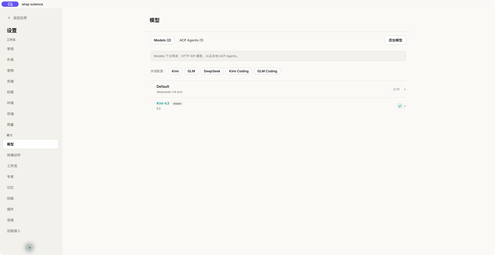

### 快速配置

如果使用 Kimi、GLM、DeepSeek、Kimi Coding 或 GLM Coding，可以点击页面上的快速配置按钮，再按服务商实际信息补全模型 ID 和 API Key。

### 自定义 HTTP 模型

点击 **添加模型**，依次填写：

1. **提供商**：选择 OpenAI 兼容、OpenAI Responses API 或 Anthropic。
2. **API 地址**：填写服务商提供的基础地址。通常不要手动追加 `/v1`、`/chat/completions`、`/responses` 或 `/v1/messages`，Wisp 会按提供商补全路径。
3. **显示名称（别名）**：只影响 Wisp 中的显示，例如 `Lab DeepSeek`。
4. **模型 ID**：必须与 API 实际接受的模型名一致。
5. **最大输出 tokens / 上下文窗口 tokens**：优先采用服务商公开上限；内置模型目录（models.dev，按精确模型 ID 匹配）认识的模型会自动带出文档上限。输出超限保存时会报错，上下文超限保存时会被收回上限。
6. **推理强度**：只有模型和网关支持时才设置；不确定时保留默认。
7. **Fast 模式（OpenAI Chat Completions / Responses）**：关闭时不发送 `service_tier`；开启后在请求顶层发送 `service_tier: "priority"`。它与推理强度相互独立，可能增加配额消耗，并作为新对话的默认值。进入对话后可通过模型选择器旁的闪电按钮单独覆盖当前对话；这不是 ACP Fast Mode。
8. **图片能力**：视觉模型勾选“支持图片输入”；如需作为全局图片观察模型，再勾选“用于图片分析”。图片生成目前使用单独的模型角色。
9. **API 密钥**：密钥保存在操作系统密钥环中，不写入项目 SQLite。同一 Base URL 可以添加多次：留空密钥复用已保存的那把；粘贴另一把密钥则为这批模型单独保存。模型 ID 相同时，用不同的显示名称区分。

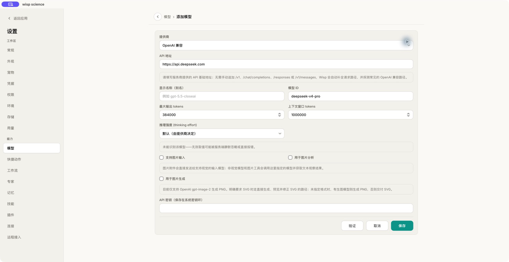

点击 **验证**，成功后再 **保存**。回到会话，在发送按钮左侧的模型选择器中选择该模型。已有消息的会话切换模型时会要求确认；默认模型只影响新会话。

如果在一轮任务运行时切换模型或修改 profile，当前 API 请求会继续使用启动该轮时的配置；新配置从下一轮开始生效。这个轮次边界避免在一个正在流式输出的请求中热切换提供商。

达到“每轮最大 Agent 迭代次数”后，Wisp 会额外发起一次不提供任何工具的收尾请求，要求模型汇总已完成、未验证和剩余工作；该请求不计入配置的迭代次数。若收尾成功，本轮以 `max_iterations` 原因正常结束；若收尾本身失败，则保留工具结果并显示可恢复错误。调试请求导出会分别记录当前配置 `configured_max_iter`、本轮实际采用的 `effective_max_iter`、`termination_reason`、`tool_schema_count` 和历史 `tool_call_count`；旧版终止事件或非 Agent 回合无法证明实际采用的上限时，`effective_max_iter` 为 `null`。

常见问题：

- `401/403`：检查 API Key、账户权限和服务商区域。
- `404`：通常是 API 基础地址或模型 ID 错误；不要盲目追加接口路径。
- 上下文溢出：在会话里执行 `/compact`，或在 **设置 → 对话** 开启自动压缩长会话。
- 输出被 `max_tokens` 截断：可在 **设置 → 对话** 开启“截断后自动继续”并设置每轮上限；达到上限后仍可使用“继续执行”。
- 图片无法读取：确认至少有一个支持视觉输入并被指定为图片分析模型的 HTTP profile。

字段和模型路由的完整说明见[模型配置](model-configuration.md)。

## 2. 配置服务器

服务器在 **设置 → 环境** 中管理。也可以打开会话右侧的 **环境** 面板，再点击 **前往设置管理环境**。

### 添加 SSH 主机

点击 **添加 SSH 主机**，填写：

1. **名称（别名）**：会话和工具中看到的名称，例如 `gpu-lab`。
2. **主机地址（HostName）**、**用户**和**端口**。
3. **认证方式**：优先使用“密钥 / agent”。
4. **密钥文件**：只填写本机私钥路径，例如 `~/.ssh/id_ed25519`。Wisp 不会把私钥内容复制进 SQLite。
5. **给 Agent 的说明**：可记录调度器、分区、module、conda 等使用约定。

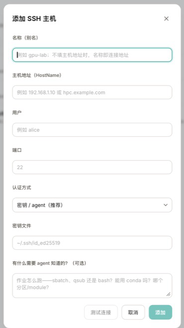

先点击 **测试连接**，通过后再添加。回到环境列表后执行 **探测环境**，让 Wisp 记录操作系统、CPU 架构、GPU、Python、R 和 SLURM 等能力；如远端解释器不在默认 PATH，再使用 **配置运行时解释器**。

如果已经维护 `~/.ssh/config`，可以使用 **一键导入 ~/.ssh/config 全部主机**。导入后仍建议逐台探测，确认别名、端口、用户和 IdentityFile 能正常工作。

### 在会话中使用服务器

打开右侧 **环境** 面板，在“附加服务器”中选择已配置主机。附加后，Agent 才能把该执行环境用于当前会话。长任务应通过结构化 Run 提交，不要让 Agent 用自由形式的 `ssh`、`scp` 或 `rsync -e ssh` 绕过环境注册和审计。

当前对话的输入框上方会列出本机、已附加的远程服务器，以及默认分析环境（即使尚未点选加入本会话），并显示各自的 Python / R 运行时状态。点击语言芯片即可打开该运行时的内存环境（变量表）；点击服务器名称打开完整的交互运行时面板。内存环境里可以用 Python / R 标签切换语言，并用筛选框按名称或类型查找对象。

### 默认分析环境

默认分析环境是**全局设置**，在 **设置 → 环境** 页顶部的下拉框里改：选某台 SSH/WSL 主机，或选「默认使用本地」。之后 Agent 调用 `python`、`r` 等接受 `context_id` 的工具时，省略 `context_id` 会在该环境运行而不是本机，并在首次使用时自动加入当前会话。Agent 仍可通过显式传 `local` 使用本机。未设置默认（或默认环境已被删除）时行为不变，回落到本机。

同一个下拉框也出现在输入框左下角 Agent 菜单的 **计算环境** 子菜单顶部。行右侧星标是快捷方式，效果相同。

该子菜单里另外一件事是**当前会话**：

1. **点击服务器行**：把该主机加入**当前会话**。行内状态为「本会话」或「未加入」。未加入时 Agent 不能显式指定该环境。
2. 若某台机器是默认分析环境但尚未点选加入，行内状态为「将自动加入」。Agent 菜单「计算环境」一行会显示「默认 CPU3」这类名称，而不是「默认使用本地」。

> 项目导出不会携带 SSH 配置和密钥。换电脑后需要重新配置并探测服务器。

## 3. 配置浏览器控制

Wisp 的真实浏览器控制使用当前 Chrome/Chromium 用户资料，不启动临时 Playwright/Selenium 浏览器，因此会保留现有登录状态、Cookie、扩展和浏览器指纹。

### 安装浏览器桥接扩展

1. 在 Wisp 会话中输入“配置浏览器控制”。Agent 会调用只读的 `browser_setup`，返回当前连接状态和这台机器上的准确扩展目录。
2. 在要控制的 Chrome 用户资料中打开 `chrome://extensions`。
3. 打开右上角 **开发者模式**。
4. 点击 **加载未打包的扩展程序**，选择 `browser_setup` 返回的 `browser-extension/` 文件夹本身，不要选择里面的单个文件或 ZIP。
5. 打开扩展弹窗，确认显示 **Connected to Wisp**。更新 Wisp 后，在 `chrome://extensions` 点一次该扩展的 **重新加载**，否则 service worker 可能还是旧文件。

扩展未连接时，Wisp 会在对话中给出醒目提示：本次回答不包含联网检索结果。可点横幅上的 **一键安装引导**：会打开浏览器的扩展管理页并复制扩展路径，剩下只需开启开发者模式并「加载已解压的扩展程序」。涉及“最新/实时”或具体网页的请求时，Agent 应暂停并引导你打开浏览器、连上扩展，而不是直接用模型已有知识作答。连接后可点 **连接后重试**。


扩展会在 Wisp 运行时连接 `ws://127.0.0.1:18765`。Wisp 与其他兼容工具可能使用同一个默认端口，因此同一时间只运行一个浏览器桥接服务。

### 验证

保持一个普通 `http://` 或 `https://` 页面打开，然后在 Wisp 中请求：

```text
列出我当前 Chrome 中的网页标签，只读取标题和 URL，不要点击页面。
```

如果能列出标签页，说明桥接成功。浏览器工具通常仍会出现审批卡；只有当前会话明确开启“完全权限”时才会自动批准。打开页面或扫描时，扩展会等到该标签的文档 `complete`（或超时）再返回；结果里的 `ready` 为 false 时，说明页面还没加载完。

### 自动打开浏览器

**设置 → 浏览器** 里的 **自动打开浏览器** 默认开启：当浏览器工具需要控制 Chrome/Chromium，而浏览器没有在运行时，Wisp 会启动你现有的用户资料（不是临时自动化浏览器），让已安装的扩展重新连上。关闭此选项后，必须自己先打开浏览器。

### 自动关闭浏览器标签页

文献检索等任务可能在一轮对话里打开很多标签。Wisp 会记录本轮由它创建的标签页（按 `tab_id`，跳转后仍算同一标签），不会把你原来就已经打开的页面算进去。

**设置 → 浏览器** 里的 **自动关闭浏览器标签页** 默认关闭。打开后，一轮结束（正常完成、停止或出错）时会直接关掉本轮打开的标签。关闭该选项时，轮次结束后会弹出确认：默认全选，你可以取消需要保留的页面，再关闭所选或全部保留。扩展暂时断开时会记住待清理列表，连上后再处理。

### 网址过滤

在 **设置 → 浏览器** 维护全局名单，跨会话生效：

- **禁用名单**：命中的域名及其子域，`web_open_tab` 和明确的跳转脚本会在打开前被拒绝，并返回用户填写的原因。
- **优先名单**：文献检索等任务应优先使用这些站点；不会阻止打开名单外的网址。

这是按域名过滤，不是内容审核。已打开的标签仍可用 `web_scan` 读取。

### 限制与安全

- `chrome://settings`、`chrome://extensions` 等内部页面不能由桥接脚本控制。
- CAPTCHA 或“确认你是真人”页面必须由用户手动完成，Wisp 不会尝试绕过。
- 原生“打开/保存”对话框和 Chrome 下载气泡不属于网页 DOM，不能由网页桥接控制。
- 对无人值守下载，可手动关闭浏览器的“下载前询问每个文件的保存位置”；多文件自动下载只应对可信站点单独授权。

完整安全边界见[真实浏览器自动化](real-browser-automation.md)。

## 4. 手动指定 Skill 和 MCP

### 为下一轮手动指定 Skill

在消息输入框输入 `/`，打开“命令、技能与工作流”选择器；继续输入名称可以筛选，然后用方向键和 Enter，或直接点击目标。选中 Skill 或工作流会附加为引用；选中内置命令则执行对应操作（也可以不经过选择器，直接输入命令文本回车）。

内置命令：

- `/compact`：归档完整历史后压缩上下文（会先把命令填入输入框，回车确认）。
- `/fork <消息>`：把消息作为当前对话的分支发送，等同发送菜单的“分支对话”。
- `/btw [问题]`：打开侧边问答；带问题时直接把问题发到侧边问答。侧边问答先让模型语义判断问题意图（会话进展/前后对比/具体内容），再按意图从当前会话冻结证据里作答；与会话无关的具体内容问题会提示证据不足。
- `/rewind`：预览并回退最后一轮，该轮消息放回输入框，等同消息上的撤销按钮。
- `/review`：让审查员审阅当前会话。
- `/remember`：把最后一轮提炼为记忆笔记（弹出确认后保存）。
- `/context`：查看上下文窗口用量。
- `/save-as-skill`：把“提炼本次会话为技能”的提示词填入输入框。
- `/skills`：打开技能管理设置页。
- `/files`：打开右侧文件面板。
- `/upload`：打开文件上传对话框。
- `/share`：打开「分享为长图」：勾选消息、打码关键词，选择导出 PNG 长图或 HTML 网页。导出 PNG 时可设置图片宽度。导出按当前对话的 Markdown 渲染结果出图（含表格与公式），不会另做一套气泡皮肤。顶栏铃铛左侧的分享按钮、输入框左侧 `+` 菜单的「分享」是同一个入口。会话还没有可分享的消息时，顶栏按钮会禁用。

助手回复中的项目文件路径可以左键预览；右键可在中间区域打开、复制绝对或相对路径，或在系统文件管理器中定位该文件。

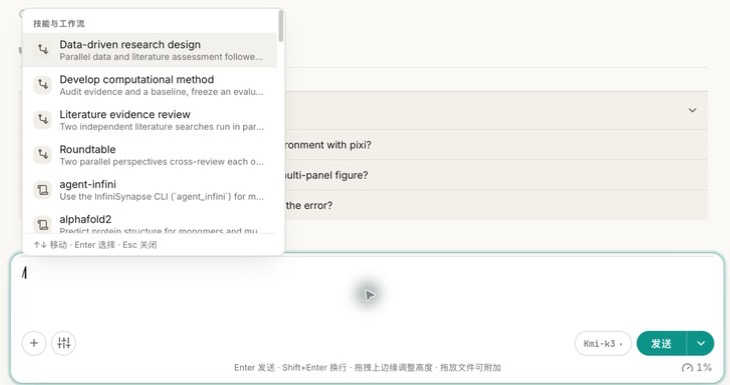

选中的 Skill 会附加到下一条消息。它只约束这一轮，不会永久改写项目配置。普通 Wisp 会话和 ACP 会话都支持 `/` 引用；`/compact`、`/fork`、`/rewind` 只在普通会话中出现，因为 ACP 会话的上下文与历史由外部 Agent 管理。

示例：

```text
/literature-review 请检索并核对这个主题近五年的综述，所有结论都给出真实来源。
```

### 为任务指定 MCP

当前版本没有逐轮的“MCP 下拉选择器”。MCP 是否可用由当前项目的 **设置 → 连接** 和已启用插件决定。需要强制范围时，在提示词里写清服务、数据库或工具边界，例如：

```text
这次只使用 PubMed MCP 检索，不要使用模型记忆补论文。先发现与“plant single-cell transcriptomics”有关的工具，再调用匹配工具，最后给出 PMID。
```

内置 Agent 会先通过 `search_mcp_tools` 发现工具，再通过 `use_mcp_tool` 调用。不要猜工具名；按数据库或目标描述能力即可。要完全停用某个 MCP，请在 **设置 → 连接** 关闭它，并新建会话或等待空闲 Agent 重建。

## 5. 导入 Claude Code / Codex 会话

Wisp 可以把独立 Codex CLI 或 Claude Code 的 JSONL 会话导入当前项目，不需要复制粘贴。

### 导入 Codex CLI

打开 **编辑 → 导入 Codex 会话**，或按 `Cmd/Ctrl+P` 搜索同名命令。默认扫描本机的 `~/.codex/sessions`。


### 导入 Claude Code

打开 **编辑 → 导入 Claude Code 会话**。默认扫描本机的 `~/.claude/projects`。


两种导入器的操作相同：

1. 在 **来源** 中选择本地、已注册的 WSL 或已配置的 SSH 主机。
2. 点击一条会话查看有界预览，确认工作目录、消息数和时间。
3. 点击单条 **导入**，或使用 **全部导入**。
4. 导入完成后，Wisp 会创建或复用 `codex` / `claude` 会话分组。

导入是幂等的：源会话后续新增内容时，列表会显示“更新”；再次导入会快进已有会话，但不会覆盖已经在 Wisp 内继续过的会话。Codex 的 AGENTS.md 包装、环境包装、推理和工具协议行会被过滤；Claude Code 的元数据行会被过滤，文本、工具调用和工具结果会保留。

> 导入的是会话内容，不会导入 Codex/Claude 的登录凭据、模型配置、MCP 配置或进程状态。

## 6. 导入 Skill 和配置 MCP

### 导入 Skill

进入 **设置 → 技能**，展开 **添加技能**：

- **添加 SKILL.md 或 ZIP**：ZIP 可以直接包含 `SKILL.md`，也可以只包一层 Skill 目录。
- **添加文件夹**：选择包含 `SKILL.md` 的完整 Skill 文件夹。

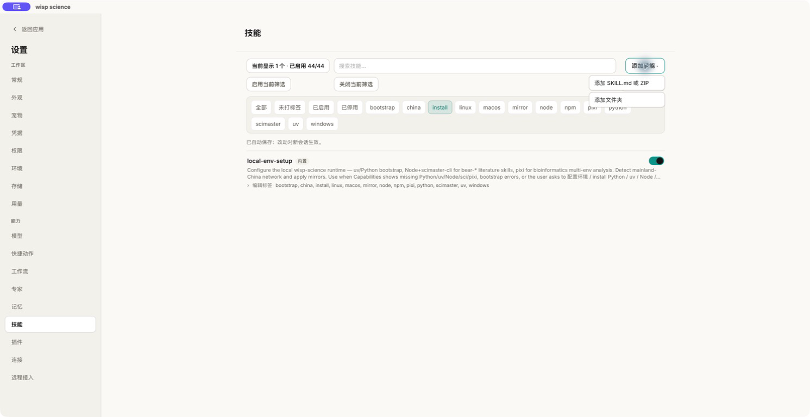

“添加技能”安装或更新的是全局 Skill。只属于当前项目的 Skill 可放入：

```text
<project>/.wisp/skills/<skill-name>/SKILL.md
```

然后点击 **重新加载技能**。同名 Skill 按 bundled、project、global、额外路径、plugin 的既定优先级解析；插件提供的 Skill 应在插件页管理，不要重复导入。

更多发现范围和覆盖规则见[Skills](skills.md)。

### 配置本地 MCP

进入 **设置 → 连接 → 添加连接**，将类型设为 **本地命令**，填写名称、可执行命令和参数，再点击 **测试**。

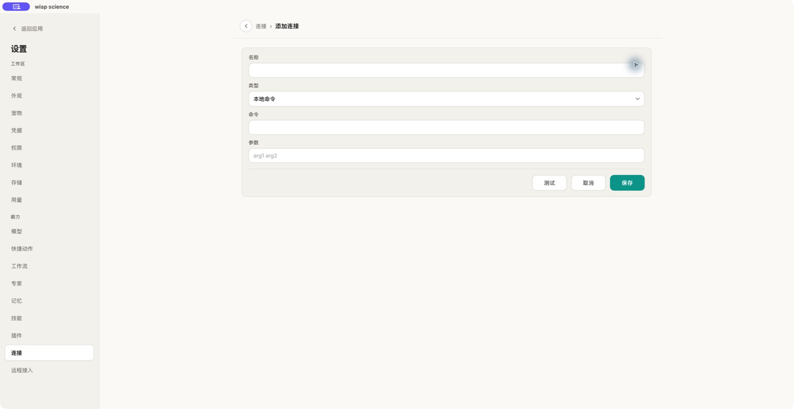

命令应指向可执行文件，不要把整段 shell 管道塞进字段。连接级环境变量用密码框填写，值只保存在操作系统钥匙串；编辑时留空会保留已保存的值，删掉一行才会清除。共用的 API Key 仍可放在 **设置 → 凭据**，新启动的本地 MCP 进程也会继承这些值。

### 配置远程 MCP

在添加连接页把类型切换为 **远程 URL**，填写服务地址和认证方式。以 Notion 为例：

```text
https://mcp.notion.com/mcp
```

选择 OAuth 后，点击 **测试**或**保存**会在浏览器中打开授权页。OAuth Token 和手写的 HTTP 请求头都保存在操作系统密钥环中；删除连接会一并清除。编辑请求头时留空保留原值。连接配置改动对新会话生效。

实时网页搜索可再添加一个远程 URL：`https://search.parallel.ai/mcp`，认证方式选 **无**。Parallel Search MCP 免费，无需账号或 API Key。

## 7. 配置 ACP

ACP（Agent Client Protocol）用于运行已经安装在本机的外部 Agent。它与 HTTP 模型配置相互独立，并且当前只支持本地 stdio。

### 前置条件

1. 安装 Node.js。
2. 安装并登录底层 Agent，例如 Codex 或 Claude Code。
3. 安装对应的 ACP adapter。不要直接把 `codex`、`claude` 或 `claude -p` 当成 ACP 命令。

可用 adapter 示例：

```bash
npx -y @agentclientprotocol/codex-acp --version
npx -y @agentclientprotocol/claude-agent-acp --version
```

### 在 Wisp 中添加

进入 **设置 → 模型 → ACP Agents**，点击 **添加 ACP Agent**。

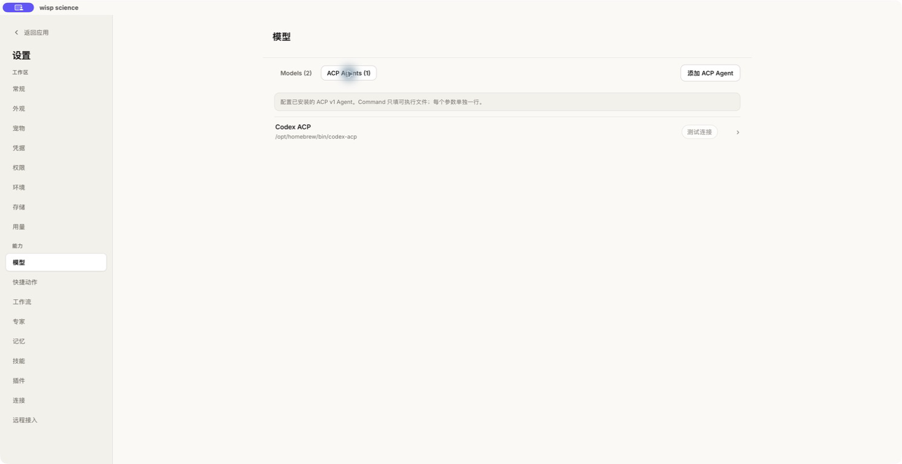

表单字段：

- **Label**：选择器中的名称。
- **Command**：只填可执行文件，例如 `npx`；Windows 通常使用 `npx.cmd` 或绝对路径。
- **Arguments**：每个参数单独一行。

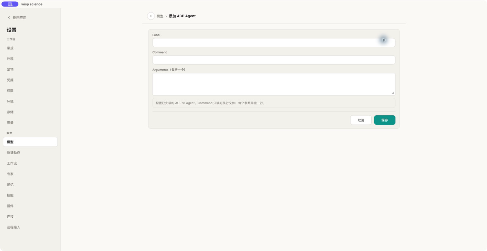

Codex ACP 示例：

```text
Label: Codex ACP
Command: npx
Arguments:
-y
@agentclientprotocol/codex-acp
```

Claude ACP 示例：

```text
Label: Claude ACP
Command: npx
Arguments:
-y
@agentclientprotocol/claude-agent-acp
```

保存后点击 **测试连接**。成功表示 Wisp 已启动进程并完成 ACP `initialize`；若 adapter 返回登录方式，按提示完成认证。对于 terminal 类型的认证，Wisp 会在集成终端中打开 adapter 声明的登录命令；在终端完成交互登录后，再次测试或启动 ACP 会话。之后在空会话的模型选择器中选择该 ACP Agent。已有消息的普通会话切换到 ACP 时，Wisp 会保留草稿并创建新的空 ACP 会话。

> ACP 进程拥有当前 Wisp 用户的本机权限。只配置可信 adapter；命令或参数改变后，原会话的进程指纹不再匹配，应新建会话。

完整示例和排错见[ACP Agents](acp-agents.md)。

## 8. 配置凭据

进入 **设置 → 凭据**。内置服务和自定义凭据都保存在操作系统钥匙串/凭据库中，不写入项目 SQLite。

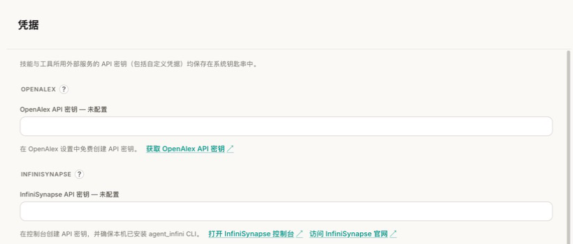

### 内置凭据

OpenAlex、InfiniSynapse、SCIMaster、NCBI 等条目带有用途说明和官方获取入口。填写后点击页面底部 **保存**。已经保存的字段通常显示“已配置”；留空会保持原值，不会把密钥明文回显。

### 自定义凭据

在“添加凭据”中填写：

1. **服务名称**：便于识别。
2. **环境变量**：Skill 或 MCP 实际读取的变量名，例如 `METASO_API_KEY`。
3. **凭据值**：API Key 或 Token。

自定义凭据只会注入新启动的本地 Python 和 MCP 进程，不会自动复制到 WSL/SSH 主机。远端环境需要在远端单独安全配置。模型 API Key 建议直接在对应模型 profile 中保存。

## 9. 配置插件（MCP App）

Wisp 插件可以把 Skill、本地 stdio MCP 服务和 MCP App 打包为一个安装单元。插件全局安装、按项目启用。

进入 **设置 → 插件**，点击 **安装插件**：

- 本地 ZIP：选择文件后检查路径和可选 SHA-256，再确认安装。
- HTTPS 发布资产：必须提供发布方公布的 SHA-256。

安装只校验和解压，不会执行 `npm install`、`postinstall` 或 shell 脚本。安装完成后，展开 **详情**，检查它提供的 Skill、MCP 命令、校验状态和运行环境。

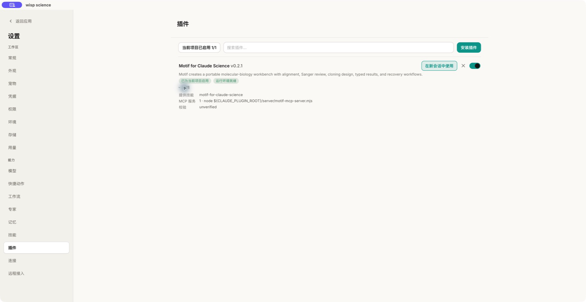

启用插件后，点击 **在新会话中使用**。插件的 MCP 进程会在新 Agent 会话构建时启动；插件 Skill 会显示在技能页，但启停和删除仍由插件卡片管理。

当工具返回 MCP App 时，Wisp 会在中间区域打开应用标签页，并保留与聊天的分屏。同一 UI 资源（或没有 URI 时的同一工具名）再次打开或搜索时会复用已有标签并更新内容，而不是再堆一个窗口。在该 App 仍绑定原始 MCP 连接时，界面内的分页、预览等操作可以通过 `tools/call` 直接打到同一个 Server（单次调用 30 秒超时，超时只失败这一次，不会拆掉 MCP 进程），不必新开一轮对话。Always-allow 按连接（含内置 `dev-mcp` / `mcp_bio`）+ 工具名分别授权。重新打开已保存的会话时，如果原连接已经不在，App 会退回把选择交给下一轮模型。MCP App 也可以把最多 64 KiB 的文本/结构化选择状态加入下一轮模型上下文；关闭 App 会清除该状态。

文档与聊天分屏时，可以拖动中间分隔线调整两侧宽度；聊天栏变窄后，模型选择和发送控件会自动缩小。

> 本地 MCP 进程不是完整的操作系统沙箱，它拥有当前用户的文件权限。只启用来源和校验和可信的插件。

打包格式和安全边界见[功能插件](feature-plugins.md)。

## 10. 配置飞书和微信

进入 **设置 → 远程接入**。飞书、微信和设备桥默认关闭，彼此使用独立凭据和安全边界。

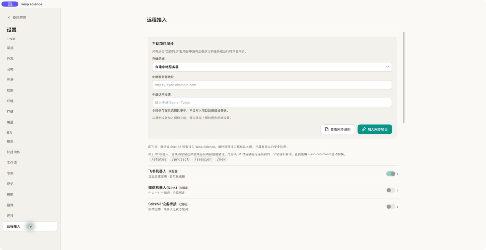

### 飞书 / Lark

推荐点击飞书机器人条目后使用 **扫码创建应用**：选择中国版飞书或 Lark 国际版，用对应客户端扫码，并在打开的页面中完成企业自建应用配置。

已有应用也可以手动配置：

1. 勾选或取消 **使用 Lark 国际版**。
2. 填写 App ID 和 App Secret。
3. 在飞书开放平台启用机器人能力。
4. 事件订阅选择 **长连接**，订阅 `im.message.receive_v1`。
5. 开通消息收发和获取机器人信息所需权限。
6. 保存后返回远程接入页并启用机器人。

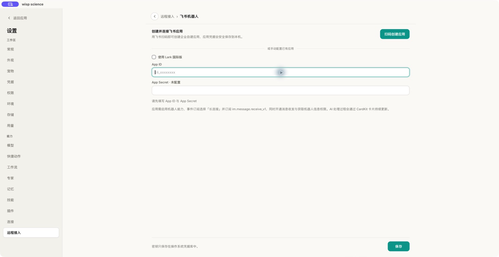

App Secret 只保存在操作系统凭据库中。扫码创建应用时，若飞书返回扫码账号的 `open_id`，该账号会成为所有者；也可以在设置里确认待配对请求，或手动填写 `open_id`。第一个给机器人发消息的人不会被自动设为所有者。只有所有者的私聊和群聊 @ 会进入 Agent；其他人会被拒绝。飞书/微信轮次里的写入、编辑、执行类工具即使桌面默认允许，仍会在桌面端弹出审批。若 CardKit 权限不足，Wisp 会退化为普通文本回复。

### 微信 iLink

打开微信机器人（iLink），点击 **扫码绑定**，用要作为 owner 的微信账号确认。

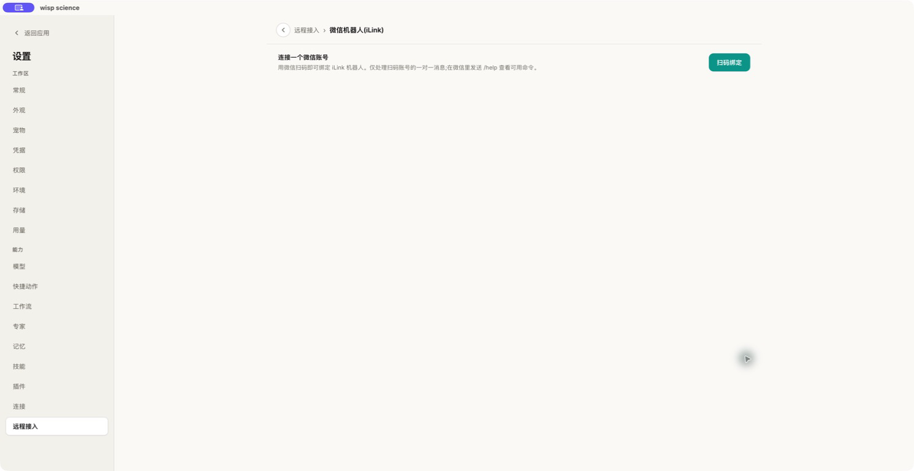

当前只处理 owner 的一对一消息，群消息会被忽略。Token 保存在系统凭据库中；服务器返回会话过期时，通道会自动停用，需要重新扫码。

### 常用 Slash Command

- `/status`：查看当前项目和共享会话。
- `/project`：列出或切换项目。
- `/session`：列出或切换会话。
- `/new`：在当前项目准备新会话。
- `/approval`：在微信中重新列出待审批请求。
- `/approve <编号>`：在微信中仅批准本次操作。
- `/reject <编号> [原因]`：在微信中拒绝操作并可附带原因。
- `/stop`：停止当前共享会话正在运行的一轮。
- `/help`：显示帮助。

桌面、飞书和微信共享“最后收到用户消息的会话”。微信发起的任务遇到 Wisp 原生工具审批或 ACP 权限请求时，会收到一次性编号和纯文本命令；远程命令不能开启完全权限或创建 Wisp 的持久化放行规则。飞书工具审批目前仍需在桌面端完成。完整说明见[IM Channels](channels.md)。

## 11. 导出和导入项目

项目 ZIP 适合离线迁移、归档备份和跨 Windows/macOS 搬迁。

### 导出

先等待项目中的 Agent turn、ACP turn、运行时写入和 Run 全部结束。然后使用任一路径：

- 打开项目，选择 **文件 → 导出当前项目**。
- 回到项目页，点击项目卡片右侧的下载箭头。

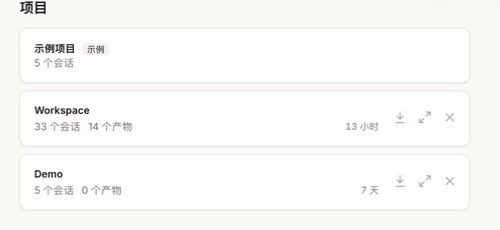

Wisp 会生成 `wisp-project-<name>.zip`，并在完成清单校验后才发布最终文件。进度窗口仍在运行时，不要复制临时或尚为空的 ZIP。

### 导入

在项目页点击顶部 **导入项目**，选择导出的 ZIP，再选择一个新的本地父目录。Wisp 会创建项目目录并校验清单；进度会显示在右下角，导入期间仍可继续使用其他项目，完成后可从项目页打开新项目。


项目包包含工作区普通文件，以及项目拥有的会话、产物、Run、计划、溯源和研究图谱记录。以下机器本地状态不会导出：

- API Key 和其他系统密钥环凭据。
- 全局设置和模型 profile。
- SSH/WSL 执行环境配置。
- 可恢复的 ACP 进程/会话绑定。

仍被记录为活动状态的任务在目标机器上会标记为 `lost`，不会自动恢复。同一设备重复导入相同项目 ID 会被拒绝，不会静默合并。详细路径规则见[项目导出与导入](project-transfer.md)。经常在多台设备间切换时，使用[手动加密同步](project-sync.zh-CN.md)。

## 12. 确认和自动建议记忆

Wisp 不会直接把一轮对话写成长时记忆。任务完成后，点击回答下方的 **记忆**，Wisp 会基于该轮用户消息、回答和工具结果生成草稿。保存前可以编辑内容，并选择作用域：

- **当前项目**：写入项目的 `.wisp/memory`，适合项目约定、已验证的排错结论和可复用步骤。
- **全局**：保存在本机应用数据库中，并在所有项目的后续任务中作为用户习惯或偏好使用；当前指令始终优先于全局记忆。

只有点击确认后草稿才会持久化。用户在消息中明确说“记住”“我的偏好”或 `remember` 时，任务完成后也会自动打开同一个确认窗口，仍不会自动保存。保存为全局记忆时可以选择新增，或显式选择一条旧记忆进行替换；Wisp 不会自行猜测两条记忆是否冲突。可以在 **设置 → 记忆** 查看或编辑项目记忆，并新增、查看、编辑或删除全局习惯（点击“新增全局习惯”直接录入，无需先发起聊天）；关闭记忆后不会生成新草稿，也不会向 Agent 注入已有记忆。

全局记忆以应用数据库为唯一事实来源。每轮开始时 Wisp 读取一次当前快照，将它作为普通用户上下文放在本轮真实请求之前；它不是 system policy，也不会写入聊天历史。同一轮后续的工具调用和自动纠正继续使用这份冻结快照。Agent 应静默应用相关条目，并静默忽略无关条目；除非用户明确询问记忆，否则不应确认、复述或解释某条记忆是否适用。新增、编辑或删除从下一轮生效，不会改变正在生成的任务，也不会改写已有历史；如果旧偏好已出现在当前聊天里，删除后仍受影响时可新建会话。项目设置中的 `.wisp/WISP.md` 是另一类 Agent Context，在新会话加载，不会每轮静默刷新。

项目记忆按需检索，不会在每轮全部注入。对于含糊或复合问题，Agent 会先生成最多四条互补检索词：保留路径、错误码、包名等精确标识符，并按需要补充概念同义词、解决步骤或时间条件。Wisp 在本地对这些查询分别执行词法检索（中文支持连续文本匹配），再合并排名并返回命中原因；没有足够证据时最多细化检索一次，不应把未命中的记忆当作事实。

工具失败分析是一个默认关闭的选项。在输入框的 Agent 菜单中启用 **自动分析工具失败** 后，可以设置失败率阈值和最少失败次数。一轮任务正常完成且同时达到两个阈值时，Wisp 会分析该轮失败工具的原因，并弹出可编辑的项目记忆草稿。取消窗口不会写入任何内容；该功能只统计有明确成功/失败结果的工具调用。

## 13. 自定义外观与主题

字号、主题、界面字体和等宽字体在 **设置 → 外观** 中调整，也可以直接在对话里让 Wisp 用 `configure` 工具修改，例如“把字再大一点”、“改成深色”。

### 导入自定义主题 CSS

单项观感偏好不再逐个增加开关，而是统一走 **设置 → 外观 → 自定义主题**：把 CSS 粘贴进文本框，或点击 **导入 CSS** 选择一个 `.css` 文件。样式在内置主题之后注入，保存即生效并跨重启保留，点 **清除** 恢复默认。也可以在对话里让 Wisp 加载 `custom-theme` 技能，由它写好 `theme.css` 再导入。

优先覆盖 `:root` 上的变量，不要去猜内置选择器：

| 变量 | 作用 | 默认值 |
| --- | --- | --- |
| `--bg-app`、`--bg-elev`、`--bg-sunken`、`--bg-input`、`--bg-panel` | 各层背景 | 随主题和配色 |
| `--text`、`--text-muted`、`--text-faint` | 正文、次要和最弱文字 | 随主题和配色 |
| `--border`、`--border-strong` | 分隔线 | 随主题和配色 |
| `--clay`、`--clay-strong`、`--clay-soft`、`--on-clay` | 强调色 | 随主题和配色 |
| `--md-table-font-size` | 回答里 Markdown 表格字号 | `calc(var(--ui-font-size) - 1px)` |
| `--md-lead-bar-width`、`--md-lead-bar-pad` | 段首加粗强调条的线宽和缩进 | `3px`、`0.55em` |
| `--radius`、`--radius-sm`、`--radius-xs` | 圆角 | 随主题 |

需要浅色和深色分别处理时，用 `:root[data-theme="light"]` 和 `:root[data-theme="dark"]` 限定。主题设为“跟随系统”时属性值是 `system`，颜色由 `prefers-color-scheme` 决定，因此这种情况要同时写 `:root[data-theme="system"]`。

### 关闭段首加粗强调条

段落的第一个内容是加粗文字时，Wisp 会在加粗内容左侧画一条竖线作为小节引导。中文排版下它容易被误读成正文里多了个 `|` 或 `丨`。把线宽和缩进设为 0 就能关掉：

```css
:root {
  --md-lead-bar-width: 0;
  --md-lead-bar-pad: 0;
}
```

只想调细或换色时，改线宽、或单独覆盖颜色：

```css
:root { --md-lead-bar-width: 1px; }
.msg.assistant .body.md > p.md-lead-strong > strong:first-child {
  border-left-color: var(--border);
}
```

强调条只作用于“段落开头就是加粗”的情况；句子中间的加粗（例如 `恒定的 **12.5px**`）不画线。

### 限制

CSS 在注入前会被净化，以下内容会被去掉：`@import`、`@namespace`、所有 `url(...)`、`javascript:`、`expression(`、`behavior:`、`-moz-binding`、`</style` 和 `<script`；超过 64 KB 的部分会被截断。所以不要依赖远程字体、图片或外部样式表；要换字体请在 **设置 → 外观** 的界面字体/等宽字体字段里填写本机已安装的字体名。

## 14. 录屏时隐藏项目

按 `Cmd/Ctrl+P` 打开操作面板并选择“隐私模式”，或直接按 `Cmd/Ctrl+Shift+H` 打开隐私模式弹窗。勾选不希望出现在录屏中的项目后点“一键隐藏”，也可以勾选列表顶部的“全选”一次性选中或清空所有项目。首页会同时隐藏对应的项目卡片、最近会话和搜索结果，且不会显示隐私模式提示；需要恢复时再次打开弹窗并点“一键恢复”。项目选择和当前隐藏状态只保存在本机。

## 15. 使用命令行

Wisp CLI 以当前目录作为项目根目录。源码仓库中使用 `cargo run -p wisp-cli`；构建或安装后可直接调用 `wisp-science`。

### 配置模型环境变量

macOS / Linux：

```bash
export WISP_PROVIDER="openai"            # openai / openai_responses / anthropic
export WISP_API_URL="https://api.deepseek.com"
export WISP_MODEL="deepseek-v4-flash"
export WISP_API_KEY="<your-provider-key>"
```

Windows PowerShell：

```powershell
$env:WISP_PROVIDER = "openai"
$env:WISP_API_URL  = "https://api.deepseek.com"
$env:WISP_MODEL    = "deepseek-v4-flash"
$env:WISP_API_KEY  = "<your-provider-key>"
```

不要把真实 Key 写进脚本或提交到 Git。桌面端的系统密钥环配置不会自动成为 CLI 环境变量。

### 交互模式

```bash
cargo run -p wisp-cli
# 或已安装后：
wisp-science
```

交互命令：

- `/q`、`/quit`：退出。
- `/n`、`/new`：开始新会话，旧会话先备份。
- `/c`、`/compact`：归档完整历史后压缩上下文。
- `/h`、`/help`：显示帮助。

### 单次任务与 JSONL

```bash
cargo run -p wisp-cli -- run "总结这个项目中的文件"
cargo run -p wisp-cli -- run --output jsonl "总结这个项目中的文件"
```

`console` 适合人读；`jsonl` 每行输出一个结构化事件，适合脚本、CI 或日志收集。

### 回归评测

```bash
cargo run -p wisp-cli -- eval --save baseline.json
cargo run -p wisp-cli -- eval --compare baseline.json --save current.json
```

### CLI 中加载 Skill 和 MCP

```bash
export WISP_SKILLS_PATH="/path/to/extra-skills"
export WISP_MCP_COMMAND="npx -y your-mcp-server"
# 或启动一个内置 bio-tools 包：
export WISP_MCP_PKG="mcp_pubmed"
```

`WISP_SKILLS_PATH` 在 Windows 可使用 `;` 分隔，在 macOS/Linux 可使用 `:` 分隔。`WISP_MCP_COMMAND` 是 CLI 启动任意 stdio MCP 的完整命令行；桌面端请改用 **设置 → 连接**。

帮助输出：

```text
Usage:
  wisp-science
  wisp-science run [--output console|jsonl] <prompt>
  wisp-science eval [--save report.json] [--compare baseline.json]
  wisp-science dev

With no command, wisp-science starts the interactive terminal.
```

## 完成后的检查清单

- 模型通过“验证”，并能在新会话完成一条普通问答。
- SSH 主机通过“测试连接”和“探测环境”，需要时已配置 Python/R 解释器。
- Chrome 扩展弹窗显示 “Connected to Wisp”。
- Skill 在 `/` 选择器中可见；MCP 在“设置 → 连接”中已启用且测试通过。
- ACP adapter 完成“测试连接”，并能在空会话中被选择。
- 凭据字段只显示“已配置”，项目文件中没有明文 Key。
- 飞书/微信使用 `/status` 能看到正确项目和会话。
- 导出的项目 ZIP 已等待进度完成，并在另一位置完成过一次导入演练。
- CLI 的 `--help`、交互模式和一条 `run` 命令均可执行。
