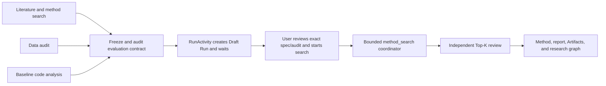

# Workflow-Native Method Search — Goal-Mode Execution Brief

**Date:** 2026-08-02

**Status:** Implemented in the working tree; verification complete

**Scope:** Wisp-native autonomous computational-method development v0

**External design reference studied (not a dependency or backend):**
[`Alistair-Turcan/TusoAI` at `04a02f80`](https://github.com/Alistair-Turcan/TusoAI/tree/04a02f80bd3e84907e78654203642043de45e71f)

**Research reference:**
[`TusoAI: Agentic Optimization for Scientific Methods`, arXiv v2](https://arxiv.org/html/2509.23986v2)

**Product reference:**
[`Biomni x TusoAI`](https://phylo.bio/blog/biomni-tuso)

## Goal-mode objective

Implement a Wisp-native, durable, auditable method-search workflow that can:

1. use the existing Workflow DAG to prepare and review a scientific method-development task;
2. freeze an exact evaluator, baseline source, data references, editable target, constraints, and budget;
3. execute a bounded candidate-generation/evaluation loop as one persisted `Run(kind="method_search")`;
4. let the owning Workflow wait without occupying an Agent/model concurrency slot;
5. survive application restart through persisted checkpoints and an explicit paused/resume lifecycle;
6. independently revalidate finalists and deliver exact Artifact versions, Run lineage, Papers, and Decisions.

The implementation is complete only when the end-to-end acceptance scenario and
all stage gates in this document pass. Partial infrastructure, a prompt-only
Skill, an untracked background process, or a one-off TusoAI wrapper does not
satisfy the goal.

## Goal-mode operating contract

- Work in the PR-sized stages below. Finish each stage's storage, compatibility,
  transfer, tests, and documentation before starting a later stage.
- Do not broaden a stage to implement multi-machine search, schedulers, generic
  cyclic workflows, arbitrary repository-wide mutation, or a full AutoML
  product.
- Reinspect current call sites before editing; filenames below are routing
  guidance, not permission for unrelated refactors.
- Preserve existing user changes and keep migrations idempotent and backward
  compatible.
- Use fake providers, fake evaluators, temporary directories, and fake command
  runners in automated tests. No test may require a real model, API key,
  network, SSH host, WSL distro, GPU, or scheduler.
- Keep Windows and macOS behavior explicit. Do not copy TusoAI's Unix-only
  `resource`, `preexec_fn`, `LD_LIBRARY_PATH`, process-fork, or colon-separated
  path assumptions into Wisp.
- Store secrets only through the existing keyring path. Never persist provider
  keys or remote credentials in SQLite, specs, logs, candidates, Artifacts, or
  Workflow results.
- Do not create commits, push branches, or open pull requests unless the Goal
  invocation explicitly authorizes those actions.
- Run the narrowest relevant checks first. Before declaring the goal complete,
  run every verification command listed in the final gate.

## Decision summary

Wisp will implement the mechanism itself. TusoAI is a research and design
reference only. It is not a Wisp backend, optional runtime, integration target,
or planned adapter. The implementation must not introduce a `TusoAI` provider,
backend selector, feature flag, configuration field, subprocess bridge, wire
protocol, checkpoint importer, or compatibility layer. Product and code-level
naming must remain Wisp-native (`Workflow`, `RunActivity`, `method_search`,
`CandidateGenerator`, `Artifact`, and `Decision`).

Ideas learned from TusoAI—iterative code mutation, evaluator-driven selection,
strategy adaptation, diversity retention, and long-horizon search—are inputs to
the design review only. Their Wisp implementation is owned by the existing
Workflow, Run, provider, Artifact, and Research Graph abstractions described in
this document.

The durable boundary is:

```text
Workflow DAG                 MethodSearch Run
-------------------------    -------------------------------------------
literature/data analysis     candidate selection
baseline inspection          bounded code mutation
evaluator construction       isolated evaluation
review and approval          strategy-weight updates
final independent review     candidate archive and checkpoints
report synthesis             progress, pause, resume, cancel
```

Workflow remains an acyclic phase-control and authorization plane. The
high-frequency candidate loop is an internal Run state machine. A candidate is
neither a Workflow node nor a top-level Run.

## Why this boundary is required

The existing Workflow implementation is deliberately bounded:

- proposals contain at most eight tasks;
- root concurrency is at most two;
- dependencies form an immutable DAG;
- tasks execute through Native or ACP Agent attempts;
- `queued` and `running` attempts are failed during startup recovery because
  Wisp does not guess whether an external Agent process survived.

Those semantics are correct for Agents but wrong for hundreds of method
candidates. Expanding every candidate into a task would exhaust task limits,
create unnecessary child conversations, mutate an already-approved plan, hold
model slots while evaluation runs, and make checkpoint recovery depend on chat
history.

The required extension is one host-native Workflow activity that waits on a
structured Run. It is not a generic loop node and does not make the Workflow
graph cyclic.

## Target user workflow



The built-in Workflow must fit within the existing eight-task root limit. The
first three tasks may run in parallel; all later tasks are dependency ordered.

## Current reusable foundations

Reuse rather than duplicate:

- `AgentWorkflow`, `AgentWorkflowStep`, attempts, approval snapshots, budgets,
  background completion, cancellation, and Workflow Studio.
- `RunRecord`, `ExecutionContext`, lifecycle leases, progress JSON, bounded log
  tails, preflight, cancellation, and Run cards.
- exact `run_inputs`, `run_outputs`, `run_code_snapshots`, and
  `run_environment_snapshots`.
- content-addressed Artifact version snapshotting and output harvest.
- project transfer, portable database hashing, project deletion order, and
  manual sync active-work checks.
- Research Graph nodes for `DataAsset`, `Paper`, `Run`, `Artifact`, and
  `Decision`.
- existing provider configuration, keyring-backed credentials, Skills,
  Specialists, and fake provider boundaries.
- delegated-worktree isolation helpers where they can be reused without
  coupling candidate evaluation to child Agent conversations.

## Explicit non-goals for v0

- Installing, vendoring, importing, invoking, wrapping, or adapting TusoAI.
- Adding a TusoAI backend option, provider type, compatibility protocol,
  configuration surface, UI choice, or import path.
- Reproducing all TusoAI prompts, heuristics, or benchmark claims.
- A generic Workflow loop/retry language or mutable runtime DAG.
- One Workflow task, Agent conversation, Run, or Artifact per candidate.
- More than one editable Python function or class per search.
- Repository-wide autonomous edits.
- Multi-machine cooperative search, shared-filesystem coordination, SLURM,
  Kubernetes, or cloud provisioning.
- GPU scheduling or evaluator jobs longer than the v0 bounded evaluator limit.
- Automatically downloading auxiliary datasets during the candidate loop.
- Treating prompt instructions as a filesystem or network security sandbox.
- Automatically applying the selected code to the user's working tree.
- Optimizing against final test/holdout results.

## Product invariants

1. **The evaluator is immutable during search.** The evaluator, protected data,
   split declaration, baseline source, and target locator are exact hashed
   inputs to the Run.
2. **Search and final verification are separate.** Candidate generation never
   observes final holdout results.
3. **One parent Run owns the search.** Candidate state is subordinate telemetry;
   only selected/checkpoint/final outputs become user-facing Artifacts.
4. **Workflow approval remains authoritative.** The activity cannot expand its
   context, network, write, model, cost, or execution authority after approval.
5. **Waiting does not consume an Agent slot.** A `waiting_run` attempt counts as
   unfinished but not as an active model/executor concurrency slot.
6. **Restart never guesses.** Agent attempts keep their existing fail-on-restart
   semantics. A linked Run activity is recovered from persisted Run/activity
   state; an unresolvable link fails explicitly.
7. **Candidate changes are scoped.** A candidate may modify only the declared
   Python symbol in an isolated copy. Any protected-file or out-of-scope diff is
   rejected before scoring.
8. **Scores are not sufficient evidence.** Promotion also requires guardrails,
   reproducibility, lineage, and final verification.
9. **No hidden secret egress.** Prompts and diagnostic payloads are bounded,
   reviewable, and scrubbed; credentials never enter persisted payloads.
10. **The main checkout is unchanged.** Applying a finalist is a separate,
    explicit reviewed action outside v0.

## Core contracts

### Workflow task kind

Extend the dynamic task proposal with a backward-compatible task kind. Existing
saved proposals that omit it remain Agent tasks.

```rust
enum WorkflowTaskKind {
    Agent,
    RunActivity,
}

struct RunActivityProposal {
    activity: String, // v0 only accepts "method_search"
    context_id: String,
    input_task_id: String,
    spec_output_pointer: String,
}
```

The activity resolves `spec_output_pointer` only from the declared direct
dependency's schema-validated result. For v0 it must resolve one exact
`method_search_spec_artifact_version_id`; arbitrary JSONPath, cross-project
lookup, raw paths, commands, and environment variables are rejected.

An approved Run activity snapshots:

- task kind and activity version;
- exact input Workflow step and output pointer;
- exact ArtifactVersion ID;
- selected ExecutionContext ID and current capability/probe revision;
- provider/model profile IDs, never credentials;
- maximum candidates, wall time, evaluator time, and cost;
- project scope and allowed workspace policy;
- approval reasons and integrity hash.

### Workflow waiting state

Add `AgentWorkflowAttemptStatus::WaitingRun` with storage value
`waiting_run`.

Semantics:

- non-terminal for dependency readiness and Workflow completion;
- excluded from Agent/executor concurrency counts;
- linked to exactly one Run through a dedicated table;
- cancellable and retryable through the root Workflow;
- retained across normal application restart;
- failed on project import when its source Run cannot be resumed safely;
- transitioned exactly once from `waiting_run` to a terminal attempt state
  when the Run becomes terminal.

Suggested link table:

```sql
CREATE TABLE agent_workflow_run_activities (
    attempt_id    TEXT PRIMARY KEY
                  REFERENCES agent_workflow_attempts(id) ON DELETE CASCADE,
    run_id        TEXT NOT NULL UNIQUE
                  REFERENCES runs(id) ON DELETE RESTRICT,
    activity      TEXT NOT NULL,
    state_json    TEXT NOT NULL DEFAULT '{}',
    created_at    INTEGER NOT NULL,
    updated_at    INTEGER NOT NULL
);
```

Do not overload `agent_session_id`, `child_frame_id`, or untyped output JSON as
the authoritative Run link.

### Method-search specification

The authoritative specification is canonical JSON stored as an exact Artifact
version. SQLite stores its ArtifactVersion ID and a canonical hash, not a
second mutable copy.

```json
{
  "schema": "wisp.method-search.v1",
  "objective": "Improve validation AUPRC without violating calibration or runtime limits.",
  "target": {
    "language": "python",
    "source_artifact_version_id": "...",
    "source_path": "analysis/scripts/model.py",
    "symbol": "fit_model"
  },
  "evaluator": {
    "artifact_version_id": "...",
    "entry_path": "analysis/workflows/evaluate.py",
    "repetitions": 3,
    "timeout_seconds": 120,
    "protocol": "wisp_evaluate_jsonl_v1"
  },
  "metrics": {
    "primary": "auprc",
    "direction": "maximize",
    "guardrails": [
      {"metric": "runtime_seconds", "op": "lte", "value": 120.0},
      {"metric": "null_fdr", "op": "lte", "value": 0.05}
    ]
  },
  "inputs": [
    {
      "role": "search_validation",
      "path": "data/validation.parquet",
      "artifact_version_id": "...",
      "external_resource_id": null,
      "checksum": "..."
    }
  ],
  "protected_paths": ["analysis/workflows/evaluate.py", "data/validation"],
  "constraints": ["Keep the target signature and output row order unchanged."],
  "strategy_sources": [
    {
      "source_ref": "doi:10.xxxx/example",
      "title": "Evidence-backed method",
      "summary": "One bounded, reviewable strategy instruction.",
      "category": "literature_or_method"
    }
  ],
  "budget": {
    "max_candidates": 20,
    "max_wall_seconds": 14400,
    "max_evaluator_seconds": 120,
    "max_cost_microunits": 5000000
  },
  "final_verification": {
    "artifact_version_id": "...",
    "path": "data/final-verification.parquet",
    "repetitions": 5
  }
}
```

V0 limits:

- exactly one top-level function, class, or explicitly supported scoped method;
- Python only;
- 3–10 baseline repetitions;
- 1–50 candidates;
- one ExecutionContext;
- serial candidate evaluation;
- one primary numeric metric and bounded numeric/boolean guardrails;
- final verification input may be absent, but the result must then be labeled
  `validation_only`, never `verified`.

### Evaluator protocol

The evaluator runs with no model interaction and emits exactly one bounded line:

```text
wisp_evaluate: {"primary":0.5717,"metrics":{"auprc":0.5717,"runtime_seconds":42.1,"null_fdr":0.031}}
```

Requirements:

- valid finite JSON numbers only; reject NaN and infinities;
- one primary score whose name matches the spec;
- all declared guardrails present;
- bounded stdout/stderr and diagnostics;
- non-zero exit, timeout, missing/duplicate result, schema mismatch, or protected
  hash drift is an evaluation failure, never a score;
- score direction is normalized internally so archive selection always
  maximizes a utility value;
- evaluator output never supplies code, paths, commands, prompts, or authority.

### Evaluator audit

Before approval, `prepare_method_search` must:

1. resolve every path inside the project and every ArtifactVersion inside the
   same project;
2. create immutable snapshots of baseline source, evaluator, and declared local
   inputs;
3. execute the unchanged baseline for the requested repetitions;
4. calculate median, spread, failure rate, and a conservative noise floor;
5. execute a candidate-reachability sentinel in a temporary source copy by
   inserting a deterministic failure at the declared symbol entry;
6. prove that the evaluator observes the sentinel failure rather than silently
   importing the original source tree;
7. verify that no protected path changed;
8. store the canonical spec and audit report as Artifact versions;
9. return only exact IDs and a compact review summary to Workflow.

The sentinel must never be written to the project source tree.

### Candidate record

Candidates are subordinate records, not product-level research nouns.

```rust
struct MethodCandidate {
    id: String,
    run_id: String,
    parent_candidate_id: Option<String>,
    sequence: i64,
    strategy_key: String,
    status: MethodCandidateStatus,
    primary_score: Option<f64>,
    utility: Option<f64>,
    metrics_json: String,
    runtime_ms: Option<i64>,
    source_sha256: String,
    patch_sha256: String,
    patch_storage_path: String,
    diagnostic_summary: Option<String>,
    error: Option<String>,
    created_at: i64,
    finished_at: Option<i64>,
}
```

Candidate source/patch bytes live in an internal content-addressed store with
bounded size and project ownership. Do not place every candidate in the normal
Artifact browser. Promote only baseline, checkpoints chosen for retention,
Top-K finalists, final selected code, complete history, plots, and reports to
Artifact versions.

Candidate storage and tables must participate in project transfer, replacement
deletion, and portable hashing in the same stage that creates them.

### Strategy state

Persist strategy statistics separately from prompts:

```rust
struct MethodStrategyStat {
    run_id: String,
    strategy_key: String,
    category: String,
    weight: f64,
    attempts: i64,
    improvements: i64,
    cumulative_reward: f64,
    summary: String,
    source_refs_json: String,
    updated_at: i64,
}
```

V0 strategy categories are:

- `literature_or_method`;
- `diagnostic`;
- `ablation_or_simplification`;
- `alternative_family`.

The initial mix is a default, not a scientific claim: 70%, 15%, 10%, and 5%
respectively. A deterministic seeded selector is required for tests.

Reward is normalized against the audited baseline noise floor:

```text
reward = clamp((candidate_utility - parent_utility) / max(noise_floor, epsilon), -5, 5)
```

Use a documented bounded update such as UCB or a normalized multiplicative
weight update. Do not describe the implementation as Bayesian unless its state
and update rule are actually Bayesian.

### Candidate selection and diversity

V0 keeps a small archive rather than only the global maximum:

- reject candidates that fail a hard guardrail;
- group identical normalized source hashes together;
- estimate diversity with a deterministic, local representation such as
  normalized token shingles/Jaccard distance; no embedding API is required;
- retain the best candidate from each bounded diversity cluster;
- when candidates are within the audited noise tolerance, prefer fewer changed
  lines, lower runtime, and fewer dependencies;
- reserve a minimum fraction of attempts for non-descendants of the current
  global best;
- preserve failed candidates' summaries and lineage without promoting their
  code to user-facing Artifacts.

### Method-search Run lifecycle

Add a specific coordinator behind the existing Run control plane; do not launch
an unmanaged daemon or keep a model turn open for the entire search.

Required states and behavior:

- `Draft`: prepared but not approved;
- `Submitted`: approved and queued for the coordinator;
- `Running`: coordinator owns a valid lifecycle lease;
- `Paused`: durable checkpoint exists; no worker is active; user may resume;
- existing `Cancelling`, `Succeeded`, `Failed`, `Cancelled`, `TimedOut`, and
  `Lost` retain their meanings.

Workflow-plan approval and Run start are separate boundaries. The activity may
prepare and link a `Draft` Run after the plan is approved, but it must not
resolve or call the provider, generate candidates, or execute the search
evaluator until the user reviews the exact spec/audit IDs in Run details and
explicitly starts that Draft. Cancelling the Draft is terminal and performs no
search.

`RunStatus::Paused` is non-terminal but excluded from active-process checks that
block project sync. Resume revalidates the exact spec, Artifact versions,
ExecutionContext, provider profile, and protected hashes before returning to
`Submitted`/`Running`.

On graceful application shutdown, a local v0 search must finish or terminate
the current bounded evaluator, checkpoint state, and become `Paused`. On startup,
an interrupted method-search Run with valid candidate state becomes `Paused`
with an explicit recovery note; it is never silently resumed. Ordinary Agent
attempt recovery remains unchanged.

### Progress contract

Keep `RunRecord.progress_json` small and replaceable:

```json
{
  "schema": "wisp.method-search-progress.v1",
  "phase": "search",
  "baseline_primary": 0.5372,
  "best_primary": 0.5717,
  "candidate_count": 21,
  "successful_count": 17,
  "failed_count": 4,
  "cost_microunits": 1300000,
  "current_strategy": "diagnostic:residual_slice",
  "last_checkpoint_at": 1785680000,
  "best_candidate_id": "..."
}
```

Full candidate history remains in candidate records and the final history
Artifact. Do not append unbounded event arrays to `progress_json`, stdout, a
conversation message, or Workflow output.

### Provider and prompt boundary

The coordinator may call the existing configured provider through a narrow
`CandidateGenerator` trait. It must not construct another standalone API client
or accept raw API keys.

```rust
#[async_trait]
trait CandidateGenerator {
    async fn propose(
        &self,
        request: CandidateGenerationRequest,
    ) -> Result<CandidateGenerationResponse>;
}
```

The request contains only:

- objective and bounded constraints;
- declared target signature and current target source;
- one selected strategy card;
- bounded parent metrics and recent relevant feedback;
- explicit output format.

The response is a replacement for the declared symbol plus a short rationale,
not a command, complete repository, evaluator, or arbitrary patch. Parse and
validate it before writing a temporary candidate copy.

Tests use a scripted fake generator. No automated test calls a provider.

## Stage plan

Each stage is one PR-sized delivery. If Goal mode is authorized to commit,
use the suggested commit and keep formatting-only drift separate as required by
`AGENTS.md`.

## Stage 0 — executable design baseline

**Suggested commit:** `docs: define workflow-native method search goal`

- [ ] Reconcile this document with current Workflow, Run, Artifact, transfer,
  Research Graph, provider, and UI behavior before implementation.
- [ ] Record any discovered incompatibility by updating this document rather
  than silently changing the architecture.
- [ ] Confirm the implementation stages remain independently reviewable.

### Gate

- [ ] No source behavior changes.
- [ ] Working tree contains only the intended documentation change.

## Stage 1 — durable Workflow RunActivity

**Suggested commit:** `feat(workflows): wait on durable run activities`

### Storage

- [ ] Add an idempotent migration for `agent_workflow_run_activities`.
- [ ] Add `WaitingRun` to attempt storage/model/validation/transition logic.
- [ ] Add typed Run-activity link CRUD with same-project and same-Workflow
  validation.
- [ ] Ensure a Run is linked to at most one activity attempt.
- [ ] Include the table/status in project transfer, portable hashing, and
  deletion order.
- [ ] Imported `waiting_run` attempts fail explicitly unless an import-specific
  safe resume contract is implemented and tested.

### Proposal and resolution

- [ ] Add backward-compatible `task_kind`, defaulting to `agent`.
- [ ] Add the bounded `RunActivityProposal` contract.
- [ ] Reject Agent-only fields on Run activities where they would be
  misleading, including Specialist, ACP executor, model override, Skill list,
  isolation request, and Agent token/tool budgets.
- [ ] Resolve a fixed `code_run`/project scope plus context and activity budget.
- [ ] Include activity authority and approval reasons in the immutable plan
  integrity hash.

### Scheduler

- [ ] Introduce a fakeable `WorkflowRunActivityDriver`.
- [ ] Atomically create a Run, link it, and transition the attempt from
  `running` to `waiting_run`.
- [ ] Release the root Agent concurrency reservation once the attempt waits.
- [ ] Keep dependency tasks blocked until the attempt succeeds.
- [ ] Map terminal Run states exactly once to attempt terminal states and a
  compact structured result.
- [ ] Propagate Workflow cancellation to the linked Run.
- [ ] Retry creates a new attempt and new Run; it never rebinds a prior Run.
- [ ] Startup recovery preserves resolvable waiting activities while retaining
  existing fail-on-restart behavior for Agent attempts.

### UI and docs

- [ ] Render a read-only Run activity node and waiting state in the Agents
  activity panel.
- [ ] Link the attempt to the existing Run detail surface.
- [ ] Do not expose the new node in Workflow Studio creation controls until the
  backend contract and fake-driver tests pass.
- [ ] Document lifecycle and restart semantics in `docs/agent-delegation.md`.

### Gate

- [ ] Fake Run activity blocks its dependent task until terminal success.
- [ ] Waiting does not consume one of the two Agent concurrency slots.
- [ ] Root cancellation cancels the fake linked Run and prevents descendants.
- [ ] Restart recovery preserves a valid waiting link and fails an invalid one.
- [ ] Existing saved Workflow JSON without `task_kind` still runs as Agent
  tasks.
- [ ] Transfer and portable hash roundtrip cover the new table and status.
- [ ] `cargo fmt --all -- --check`
- [ ] focused `wisp-store` and Workflow runtime tests
- [ ] `cargo test --workspace`

## Stage 2 — frozen evaluation contract

**Suggested commit:** `feat(method-search): freeze and audit evaluation contracts`

### Domain and storage

- [ ] Add versioned Rust types for `wisp.method-search.v1` and evaluator
  results.
- [ ] Validate all IDs, limits, finite metrics, score direction, guardrails,
  project ownership, and JSON bounds.
- [ ] Persist the canonical spec and audit report through existing Artifact
  version APIs.
- [ ] Bind source, evaluator, validation data, final-verification data, and
  external resources through exact Run inputs with declared roles.
- [ ] Capture the baseline code and environment through existing Run lineage.

### Preparation and audit

- [ ] Add a `MethodSearchEvaluator` trait with a fake runner boundary.
- [ ] Implement project-contained path resolution for local v0 preparation.
- [ ] Run baseline repetitions and calculate robust summary/noise values.
- [ ] Implement the temporary-copy sentinel reachability test.
- [ ] Check protected hashes before and after every audit execution.
- [ ] Fail closed on ambiguous symbol location, evaluator output, import path,
  score direction, missing metric, or guardrail.
- [ ] Expose `prepare_method_search` as a native tool/command that returns exact
  ArtifactVersion IDs and the bounded audit summary.
- [ ] Require ordinary execution/network/write approval through existing
  mechanisms; do not add an implicit full-permission exception.

### Gate

- [ ] Baseline repetition test estimates deterministic noise from a fake
  evaluator.
- [ ] Sentinel test detects an evaluator that imports the original source.
- [ ] Protected evaluator/data mutation fails before a spec is approved.
- [ ] NaN, infinity, duplicate output, timeout, non-zero exit, and missing
  guardrail tests fail closed.
- [ ] Windows and POSIX path fixtures remain project-contained.
- [ ] Tests require no provider, network, SSH, WSL, GPU, or real Python
  installation.
- [ ] `cargo fmt --all -- --check`
- [ ] focused store/tool tests
- [ ] `cargo test --workspace`

## Stage 3 — candidate persistence and resumable coordinator

**Suggested commit:** `feat(method-search): run resumable candidate searches`

### Storage and lifecycle

- [ ] Add idempotent candidate, strategy-stat, and internal blob-reference
  storage.
- [ ] Add `RunStatus::Paused` and update every exhaustive match, transition,
  active-run query, transfer rule, DTO, and UI badge.
- [ ] Add method-search coordinator ownership/lease rules using the existing Run
  lifecycle patterns.
- [ ] Store the canonical spec ArtifactVersion ID and activity version with the
  Run.
- [ ] Add tables/blobs to transfer, deletion order, and portable hashing.
- [ ] Bound candidate count, source size, patch size, metrics, diagnostics, and
  log tails.

### Candidate execution

- [ ] Add fakeable `CandidateGenerator` and evaluator boundaries.
- [ ] Create the baseline candidate from the frozen source.
- [ ] Apply replacement source only to the declared symbol in an isolated
  temporary copy.
- [ ] Reject syntax failure, signature drift, extra changed files, protected
  drift, out-of-scope writes, and oversized output.
- [ ] Evaluate serially and persist every candidate terminal result before
  scheduling the next candidate.
- [ ] Update bounded Run progress after every persisted result.
- [ ] Check Run cancellation, wall time, candidate count, and provider cost
  between every state transition.
- [ ] Checkpoint before pause, cancellation, timeout, and terminal completion.

### Recovery

- [ ] Graceful shutdown converts a local running search into `Paused` after the
  current bounded evaluation is stopped or completed.
- [ ] Startup converts a recoverable interrupted method-search Run to `Paused`
  with a reason; it does not auto-resume.
- [ ] Resume revalidates all exact inputs, context, provider configuration, and
  protected hashes.
- [ ] Missing/corrupt candidate blobs or incompatible spec versions fail
  explicitly without discarding prior history.

### Gate

- [ ] A scripted fake generator and evaluator complete a 20-candidate search.
- [ ] Cancelling between candidates creates no later candidate.
- [ ] Crash/reopen simulation resumes from the next sequence without repeating
  a persisted candidate.
- [ ] Cost, candidate, time, output-size, and evaluator-time budgets each stop
  independently.
- [ ] Candidate paths and blobs survive project transfer.
- [ ] Normal Artifact listings do not contain every candidate.
- [ ] `cargo fmt --all -- --check`
- [ ] focused coordinator/store tests
- [ ] `cargo test --workspace`

## Stage 4 — adaptive search and independent verification

**Suggested commit:** `feat(method-search): select diverse verified finalists`

### Strategy generation

- [ ] Build bounded strategy cards from the exact Workflow evidence supplied in
  the frozen contract; do not perform hidden network discovery in the loop.
- [ ] Use existing provider profiles through `CandidateGenerator`.
- [ ] Persist source references and compact summaries, not complete paper PDFs
  or conversation histories, in strategy state.
- [ ] Implement deterministic weighted selection and bounded adaptive updates.

### Archive and diversity

- [ ] Implement normalized-source identity and deterministic local diversity.
- [ ] Retain bounded champions across distinct clusters/families.
- [ ] Prefer simpler/faster candidates inside the audited noise tolerance.
- [ ] Enforce a configurable diversity floor away from the current best's
  descendants.
- [ ] Record parent, strategy, rationale, score delta, failure, and reward.

### Final verification

- [ ] Select a bounded Top-K set across score, diversity, runtime, and
  simplicity.
- [ ] Recreate each finalist from frozen baseline plus stored candidate source
  in a clean allowlisted workspace.
- [ ] Run final verification repetitions without feeding results back into
  search.
- [ ] Promote Top-K source, selected method, full history, verification report,
  and summary plots to Artifact versions.
- [ ] Mark the result `verified` only when an independent final-verification
  contract exists and all required checks pass; otherwise use
  `validation_only`.
- [ ] Create or link Research Graph nodes: Papers/strategies inform Decisions;
  DataAssets feed the Run; the Run produces Artifacts; a Decision selects the
  finalist.

### Gate

- [ ] A higher primary score that violates a guardrail is not selected.
- [ ] Statistically indistinguishable candidates prefer the simpler/faster one.
- [ ] Diversity retention keeps at least two families in a deterministic
  fixture.
- [ ] Final-verification metrics never alter search weights or candidates.
- [ ] Clean reconstruction reproduces the stored source hash.
- [ ] Research Graph and Run lineage use exact IDs.
- [ ] `cargo fmt --all -- --check`
- [ ] focused search/verification tests
- [ ] `cargo test --workspace`

## Stage 5 — Workflow Studio and product surface

**Suggested commit:** `feat(ui): orchestrate computational method development`

### Workflow template

- [ ] Add the built-in read-only **Develop computational method** Workflow with
  the seven-node graph shown above.
- [ ] Bind literature/data/baseline tasks only to their required Skills and
  capabilities.
- [ ] Give evaluator construction and audit exact structured output contracts.
- [ ] Make the method-search node consume only the audited spec ArtifactVersion
  ID from its declared predecessor.
- [ ] Run final verification and synthesis only after the activity attempt
  succeeds.

### Workflow Studio

- [ ] Add an Agent/Run activity type selector for supported nodes.
- [ ] For `method_search`, show context, frozen-input binding, candidate/time/
  cost/evaluator budgets, and approval reasons.
- [ ] Hide Agent-only Specialist/model/ACP/Skill/isolation fields from a Run
  activity.
- [ ] Render Run activity nodes distinctly without introducing graph cycles.
- [ ] Preserve existing graph editing, dependency validation, minimap, and
  built-in-copy behavior.

### Run and results UI

- [ ] Extend Run cards/details for method-search phase, baseline, best score,
  candidate counts, cost, current strategy, checkpoint age, and selected
  context.
- [ ] Add pause, resume, cancel, inspect Top-K, and open final Artifact actions.
- [ ] Show candidate lineage and code diffs only on demand; do not render the
  full history in the normal Run list.
- [ ] Require explicit review before any later feature applies a finalist to the
  working tree.
- [ ] Add English and Chinese strings and update user-facing documentation.
- [ ] Every new dialog/popover participates in the window-level Escape stack;
  immediate Escape closes only the topmost surface.

### Gate

- [ ] Playwright creates/copies the built-in Workflow and renders the correct
  seven-node DAG.
- [ ] A mocked method-search activity waits, survives reload, completes, and
  unlocks final verification.
- [ ] Pause/resume/cancel controls invoke the expected mocked commands.
- [ ] Immediate Escape tests cover every new dismissible surface.
- [ ] Existing Agent-only Workflow creation and execution remain unchanged.
- [ ] `cd ui && cargo check --target wasm32-unknown-unknown`
- [ ] `cd ui-tests && npm ci && npx playwright test`
- [ ] `cargo fmt --all -- --check`
- [ ] `cargo test --workspace`

## End-to-end acceptance scenario

Use fixtures and a fake provider/evaluator for automated acceptance:

1. Create a temporary project with one Python source file, one immutable
   validation dataset fixture, one evaluator, and an optional final-verification
   fixture.
2. Instantiate the built-in **Develop computational method** Workflow.
3. Let mocked preparation tasks return an audited
   `method_search_spec_artifact_version_id`.
4. Approve the exact resolved plan.
5. Start the Run activity and confirm the attempt becomes `waiting_run` while a
   separate independent Agent task can use the released concurrency slot.
6. Generate twenty deterministic candidates with successes, syntax failures,
   evaluator failures, a guardrail-violating high score, and at least two method
   families.
7. Pause after a checkpoint, simulate restart, verify no automatic execution,
   resume explicitly, and finish without duplicate candidate sequence numbers.
8. Revalidate Top-K in clean workspaces and select the expected simple,
   guardrail-compliant candidate.
9. Confirm exact Run inputs, code/environment snapshots, output Artifact
   versions, strategy/Paper references, and Decision links.
10. Confirm no candidate changed the project checkout, evaluator, validation
    data, or final-verification data.

## Manual smoke scenario

After automated gates pass, use a local project and a configured low-cost model:

1. Create a small deterministic classification or regression fixture whose
   evaluator completes in under one minute.
2. Open Workflow Studio, copy **Develop computational method**, inspect all
   node capabilities, and start it from a dedicated conversation.
3. Review the evaluator audit: baseline repetitions, noise, sentinel
   reachability, hashes, protected paths, context, and budgets.
4. Approve a 10–20 candidate local search and keep the application open.
5. Observe waiting Workflow state and live Run progress without repeated model
   polling.
6. Pause, restart Wisp, confirm the search remains paused, and resume it.
7. Inspect Top-K diffs and final-verification evidence.
8. Confirm the project source is unchanged and selected code exists only as an
   Artifact until explicitly applied in a later workflow.

Do not use unpublished biological claims, private datasets, paid large-scale
search, or remote/GPU infrastructure for the first smoke test.

## Failure and cancellation semantics

| Condition | Required outcome |
| --- | --- |
| Preparation task fails | Downstream evaluator/search nodes are blocked; no Run is created |
| Spec output is missing/ambiguous | Run activity attempt fails before Run creation |
| User rejects approval | No candidate/provider/evaluator execution occurs |
| Baseline audit is unstable | Spec remains unapproved with actionable findings |
| Candidate generation fails | Record failed candidate; continue if retry/budget policy permits |
| Candidate violates protected boundary | Record rejected candidate; never score or retry unchanged output |
| Evaluator fails or times out | Record evaluation failure; never convert it to a numeric score |
| Provider budget exhausted | Checkpoint and finish with an explicit budget terminal reason |
| User pauses | Stop at a safe candidate boundary, checkpoint, set Run `Paused`, keep Workflow waiting |
| User cancels Workflow | Cancel Run, terminalize waiting attempt once, block descendants |
| App shuts down | Checkpoint and pause local method search; do not auto-resume |
| Linked Run is missing/corrupt | Fail activity explicitly and preserve prior candidate evidence |
| Final verification fails | Preserve search results but do not mark the method verified |

## Verification commands

Run focused tests during each stage, then the complete suite before Goal
completion:

```bash
cargo fmt --all -- --check
cargo test --workspace
cd ui && cargo check --target wasm32-unknown-unknown
cd ../ui-tests && npm ci && npx playwright test
```

If MCP schemas or the Wisp MCP bridge are changed to expose Run activities or
method-search controls, also run:

```bash
cargo run -p wisp-mcp --example smoke
```

If `cargo fmt --all -- --check` finds pre-existing or generated drift, run
`cargo fmt --all` only when appropriate and keep formatting-only changes
separate from behavioral work.

## Final completion audit

- [x] TusoAI appears only in documentation as design/research attribution; no
  runtime dependency, backend option, adapter, protocol, persisted type, or UI
  control refers to it.
- [x] Workflow remains an immutable DAG; no candidate iteration is represented
  as a Workflow node.
- [x] Run activity authority is frozen and approval-visible.
- [x] `waiting_run` is durable, releases Agent concurrency, recovers safely,
  and transitions terminally exactly once.
- [x] Evaluator, data, baseline, target, and constraints are exact immutable
  inputs.
- [x] Search and final verification are separated.
- [x] Candidate state is bounded, queryable, transferable, and not exposed as
  thousands of normal Runs/Artifacts/messages.
- [x] Pause/resume/cancel/restart behavior is tested without external services.
- [x] Provider use goes through existing configuration and keyring paths.
- [x] Local path behavior works on Windows and macOS fixtures.
- [x] Run outputs, Artifact versions, environment/code snapshots, and Research
  Graph links form a complete evidence chain.
- [x] Built-in Workflow and UI satisfy Escape-stack and mocked Playwright
  requirements.
- [x] Full Rust, WASM, and Playwright verification passes. The conditional MCP
  smoke gate is not applicable because this implementation does not expose new
  MCP schemas or bridge controls.
- [x] User-facing docs list v0 limitations and manual smoke steps.

## Verification result

Verified on 2026-08-02 with:

- `cargo fmt --all -- --check`;
- `cargo test --workspace`;
- `cd ui && cargo check --target wasm32-unknown-unknown`;
- `cd ui-tests && npm ci && npx playwright test` — 258 passed, 1 conditional
  real-MCP test skipped;
- a repository audit confirming the external design reference appears only in
  this execution brief and is absent from runtime, persisted, provider, and UI
  identifiers.

## Deferred follow-ups

Only after v0 is complete and measured:

1. multiple editable targets with joint candidate state;
2. parallel candidate evaluators with CPU/RAM/GPU resource accounting;
3. long-running evaluator child Jobs beyond the v0 bounded evaluator limit;
4. SSH/WSL method-search execution with explicit remote-secret policy;
5. scheduler-backed Runs and multi-machine shared-search coordination;
6. safe auxiliary-data discovery as a separate Workflow phase;
7. richer multi-objective/Pareto selection and statistical tests;
8. explicit reviewed application of a selected patch to the working tree;
9. publication-facing method cards and evidence-capsule integration.
