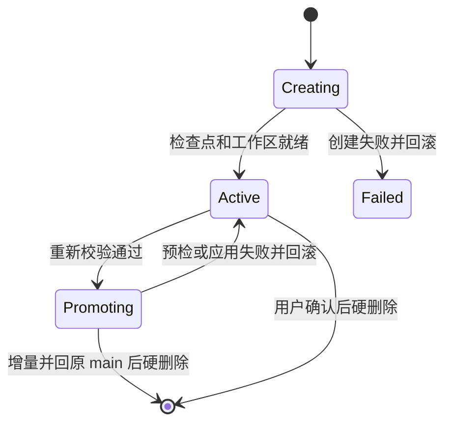

# 隔离探索分支与主线晋升设计

> 对应 Issue：[#726 支持隔离探索分支并将成功分支晋升为主线](https://github.com/xuzhougeng/wisp-science/issues/726)
>
> 状态：设计提案；本文不代表已经实现。

## 结论

把“探索”建模为一个项目状态覆盖层，而不是普通会话副本或 Git 分支：

1. `ExplorationCheckpoint` 冻结一个已完成会话边界，以及该边界对应的文件、ArtifactVersion、终态 Run、Decision/Research Graph 和模型上下文引用。
2. `Exploration` 拥有持久、独立、可写的工作区；分支产生的项目记录都带 `exploration_id`，普通主线查询不会看到它们。
3. 探索轮持续冻结 source main 和 Wisp 管理的主线项目写入；只有采用某个候选或显式放弃整轮才能解除冻结。
4. `PromotionOperation` 通过项目级独占锁、重新校验、可恢复文件日志和一个 SQLite 事务，把成功探索的增量 fast-forward 回原 main，并清理包括所选探索在内的全部候选；显式放弃则不合并增量，仅清理全部候选。

第一阶段仅保证“从当前已完成主线头创建探索”。当前系统没有逐轮完整文件快照，不能可靠重建升级前任意历史轮次的项目状态；任意历史轮次将在后续通过逐轮 `ProjectStateRevision` 实现，不能用现有 `turn_file_undo` 假装可恢复。

## 现状与设计依据

当前实现有四个直接约束：

- `src-tauri/src/session_commands.rs::branch_session` 只新建 frame、复制 `messages` 和模型设置；`branched_from` 在 Store 中明确是仅供侧栏展示。
- 所有普通会话共享 `ActiveProject.root`。文件工具、Memory、Skills、Artifact 解析和本地 Run 默认都指向同一个项目目录。
- Artifact 的逻辑键和 `latest_version_id` 是项目级全局状态。仅复制 frame 无法阻止探索更新主线 Artifact 头。
- `delegation_isolation.rs` 已有 Git worktree、补丁预检和清理能力，但它要求干净 Git checkout、执行结束即回收，也不覆盖对话、未跟踪文件、Artifact、Run、Decision、Memory 或非 Git 项目。

因此不能把现有 `branch_session` 改名，也不能只把 `GitWorktreeIsolation` 暴露给 UI。

## 产品语义

### 用户看到的名词

- **开始探索**：从一个一致性检查点派生独立试验。
- **主线**：当前被项目采用的会话和项目状态。
- **设为主线 / 采用此探索**：选择一个候选成为崭新的 main，并清理同轮其他探索产物。
- **丢弃探索**：删除探索私有工作区和私有记录；不得修改主线。
- **放弃探索**：从 source main 的右键菜单结算整轮；保留原 main，删除所有探索及其私有产物。

产品文案不使用“自动合并”描述晋升。

### 状态机



丢弃没有持久化终态，也不保留 tombstone。把一个候选设为主线时，只将它在冻结点之后的增量并回原 main；同轮所有探索（包括所选探索）都会永久删除，其私有记录、对话、隔离工作区、快照 manifest 和上下文归档一并清理。

## 范围

### MVP

- 从当前 native 会话的最新已完成轮次创建多个探索。
- 小型和普通项目文件的完整隔离，包括未跟踪文件和 `.wisp/memory`。
- 分支内新增/修改 Artifact、终态 Run、Decision/Research Graph 记录的隔离。
- 文件、Artifact、Run、Decision 和外部副作用差异预览。
- 冻结 source main 和所有 Wisp 管理的主线项目写入。
- 可恢复 fast-forward，以及失败时不提前解除冻结。
- 单独丢弃探索和显式放弃完整探索轮。
- macOS、Windows 和 Linux/WSL 的显式文件策略；自动测试不依赖真实 SSH、WSL、GPU 或网络。

### 非目标

- 两条已前进状态线的三方合并。
- 对话拼接、对话冲突解决或把多个探索同时晋升。
- 自动回滚远程作业、外部 API、邮件或数据库写入。
- 用 Git commit 历史作为用户项目的唯一真相。
- 在 MVP 中克隆 ACP 服务端隐藏会话、外部导入会话或 Agent 委派子树。
- 在 MVP 中从升级前任意历史轮次恢复当时的项目文件。
- 在探索中编辑 Publication、项目设置、同步配置、插件安装或其他尚未 scope-aware 的项目级对象。

## 核心模型

### 1. `ExplorationCheckpoint`

不可变检查点包含：

- `source_frame_id` 和已完成轮次的 `source_message_seq`；
- 当时 source frame 的最大消息序号和 UI event 边界；
- 模型、Specialist、Plan/Delegation 开关、ExecutionContext 选择等会话配置快照；
- 一个可移植的完整上下文归档引用；
- `WorkspaceSnapshot`；
- Artifact 的具体 head version；
- 已完成 Run、Decision/Research Node/Edge、ExternalResource 的成员快照；
- 项目元数据 generation 和整体 `guard_hash`；
- 不可恢复或仅引用资源的摘要。

创建检查点时必须满足：

- source frame 属于当前项目；
- 目标轮次已完成，消息和 UI event 已持久化；
- source frame 没有运行中 turn 或待持久化队列；
- MVP 中目标轮次必须是 source frame 当前头；
- 项目不能正在同步、导入、删除或执行另一个晋升；
- 活跃 Run 必须结束或由用户显式取消。活跃远程 Run 不能成为可晋升基线。

多个探索共享同一不可变检查点和内容寻址 blob，但拥有不同工作区。检查点创建按
`(family_id, source_frame_id, source_message_seq, guard_hash)` 幂等复用；面向 UI 的
`start_exploration` 在项目独占锁内完成检查点复用和候选创建，不能暴露“两次调用之间主线仍可写”的空窗。

每个首次进入探索工作流的普通会话会创建一个 `ExplorationFamily`。它持久记录
`root_frame_id` 和当前 `mainline_frame_id`；晋升通过 compare-and-swap 把 family 的
mainline 从 checkpoint source 更新为被采用 frame。这样后续可以从新主线继续探索，
而不是靠侧栏当前选中项猜测哪条会话是主线。

同一 family generation 中仍然存在的 `creating`、`active`、`promoting` 或 `failed` 候选构成当前探索轮。只要该 generation 未被结算，source main conversation、workspace、Memory、Artifact、Runtime 和新的项目写入口都保持冻结；其他普通 conversation 仅允许讨论和只读检查。被丢弃的候选立即从该集合和持久化存储中消失。

候选失败或单独丢弃只改变候选自身，不推进 family generation，因此不能解除冻结。只有两条结算路径会推进 generation：晋升一个候选时采用该 frame 为新 main，并在同一元数据事务中永久清理同轮其他候选；放弃整轮时保留原 main，并在同一元数据事务中永久清理全部候选。

### 2. `ExplorationScope`

探索不是第二个 Project。它仍属于原 Project，但所有会泄漏的写入都带 scope：

```rust
pub enum StateView {
    Mainline { project_id: String },
    Exploration {
        project_id: String,
        exploration_id: String,
        checkpoint_id: String,
    },
}
```

Tauri 在确定 `frame_id` 后解析 `WorkingProject`：

```rust
pub struct WorkingProject {
    pub project_id: String,
    pub root: PathBuf,
    pub state_view: StateView,
    pub memory: Arc<MemoryManager>,
    pub skills: Arc<SkillIndex>,
}
```

普通 frame 使用主线 root；探索 frame 使用探索 root。Agent、文件浏览器、Artifact 命令、Memory、运行时、Reader 引用和本地 Run 必须全部从同一个 `WorkingProject` 构建，不能一部分仍读取 `ActiveProject.root`。

### 3. 元数据覆盖层

探索读取视图由两部分组成：

- 检查点冻结的 baseline entity/member/head；
- `exploration_id` 所有的新增或覆盖记录。

主线查询只读取 mainline head 和 `exploration_id IS NULL` 的记录。它永远不能使用“同 Project 的全部记录”作为探索可见性条件。

Artifact 需要单独的 head 表：

```text
artifact_heads
  project_id
  scope_key          # "mainline" 或 exploration UUID
  logical_key
  artifact_id
  artifact_version_id
  updated_at
  PRIMARY KEY(project_id, scope_key, logical_key)
```

这样探索修改同一个逻辑 Artifact 时会创建分支私有 Artifact/Version，并把 `parent_version_id` 指向检查点 version；它不会修改 `artifacts.latest_version_id` 所代表的旧主线缓存。晋升只需把探索改变的 head 原子写入 `scope_key='mainline'`，旧 version 和旧消息引用仍然有效。

checkpoint 使用单独的 `exploration_baseline_artifact_heads` 冻结
`logical_key → artifact_id/version_id`，不能在探索读取时重新查询后来可能已经变化的
mainline head。其他 baseline member 放在 `exploration_baseline_entities`。

Run、Research Node/Edge 和 ExternalResource 增加 nullable `exploration_id`。检查点只继承终态 Run；探索产生的新记录属于探索。MVP 不允许原地编辑 baseline Decision，修改应生成一个带溯源关系的新 Decision。

frame-owned 数据（messages、UI events、execution log、review、plan、workflow delivery）通过探索 frame 自然隔离；项目级列表仍需通过 frame 或 `exploration_id` 过滤。

### 4. 工作区快照与物化

`WorkspaceSnapshot` 是可校验 manifest，不是无条件压缩整个目录：

```rust
pub struct WorkspaceSnapshotEntry {
    pub path: String,             // 项目相对、正斜杠、无 ..
    pub size_bytes: u64,
    pub checksum: Option<String>, // SHA-256；已有 DataAsset checksum 优先复用
    pub executable: bool,
    pub materialization: SnapshotMaterialization,
    pub reference_uri: Option<String>,
    pub recoverable: bool,
}

pub enum SnapshotMaterialization {
    Blob,
    Reference,
    RemoteReference,
    Unsupported,
}
```

策略：

- 普通文件写入 app data 下的内容寻址 blob，并通过平台 clone/reflink 或普通复制物化到每个探索目录；绝不使用可写 hard link。
- `.git`、socket、device、symlink 和探索内部管理目录不进入可写副本。symlink 不跟随，显示为未隔离项。
- 大文件默认保存 path/URI、size、mtime 和已有 checksum；没有 checksum 时标记弱引用。它们不会伪装成可回滚文件。
- 远程数据使用 `ExternalResource`/DataAsset 引用、metadata 和 checksum，不下载整份数据。
- 分支根目录位于持久 app data，例如 `explorations/<project>/<id>/workspace`，不能放在系统临时目录。
- 分支目录中生成 `.wisp/exploration-references.json`，Agent 每轮收到简短提示；该文件属于探索内部元数据，不进入用户差异或晋升。引用资源的写操作仍需走显式外部副作用审批。

MVP 对超过物化阈值且未显式复制的大文件给出“部分隔离”警告。该探索可以运行，但只有未触碰这些引用时才允许一键晋升；若引用的 checksum/size 变化，晋升拒绝。

### 5. 会话与模型上下文

创建探索 frame 时：

- 复制到完成轮次边界的 messages；
- 复制对应 UI events、resource links、review 和必要的 plan/config 审计；
- resource link 继续指向检查点的不可变 ArtifactVersion；
- 复制模型、Specialist、ExecutionContext 和允许的会话能力配置；
- 不复制 source frame 的内存 runtime 或 ACP session handle；
- 重新生成 system message 的项目规则、WISP 规则和 Environment 工作目录，不能保留主线绝对 cwd；
- 为探索工作区构造独立 `MemoryManager` 和 skill index。

上下文压缩归档不能继续只依赖绝对路径字符串。新增 `context_archives` 注册表和逻辑引用（例如 `wisp-history:<id>`），读取时按当前 `WorkingProject.root` 解析。创建探索时复制/共享归档 blob；旧绝对路径 tombstone 仅在迁移路径中受控重写。

晋升后 source frame 保持原 ID 和侧栏位置。只把所选探索在检查点之后新增的消息、UI events 和相关对话记录迁回 source frame，使其从 `A → B → C` 变成 `A → B → C → D2 → E2`；克隆的检查点前缀不会重复写入。所选探索与同轮其他探索的记录、frame、对话和私有数据全部硬删除，不保留 discarded tombstone。原 main 已有的普通对话分支继续挂在同一个 source frame 下。

### 6. 主线 guard

一键晋升的 guard 不是单个 Git SHA，而是以下内容的 canonical hash：

```text
exploration family id + generation + mainline frame id
source frame id + source head message seq
project state generation
workspace manifest hash
mainline Artifact head set hash
terminal Run member/fingerprint hash
Decision/Research member hash
referenced large/remote resource fingerprint hash
```

主线 Artifact/Run/Decision 写入必须事务性增加
`project_state_counters.mainline_generation`；探索写入只增加对应
`explorations.scope_generation`。如果探索写入也增加 mainline generation，探索自己的第一处
变更就会错误地阻止晋升。文件系统可能被外部编辑器修改，所以晋升仍必须重新扫描
manifest，不能只信 generation。

探索轮开启后，统一写 guard 直接拒绝 source frame 新消息、分支创建、移动和删除，并拒绝 Wisp 管理的主线项目写入。带普通对话分支的 main 也不能删除，必须先删除分支。
外部编辑器和 Wisp 进程外的写入无法由应用锁住，因此文件 manifest 复核仍是晋升的最终安全边界。文件 guard 按所选探索实际改动的路径求交集：同路径变化阻止晋升；非重叠路径属于其他会话或外部生产者，既不进入冲突预览，也不阻止晋升，并在应用探索补丁时原样保留。

### 7. 差异模型

后端提供结构化差异：

```rust
pub struct ExplorationDiff {
    pub files: Vec<FileDelta>,
    pub artifacts: Vec<ArtifactHeadDelta>,
    pub runs: Vec<RunDelta>,
    pub decisions: Vec<DecisionDelta>,
    pub external_effects: Vec<ExternalEffect>,
    pub skipped_or_referenced: Vec<IsolationWarning>,
}
```

文件差异是 checkpoint → exploration；晋升资格另行比较 checkpoint → current mainline，并只保留与 exploration 差异路径相交的主线变化。UI 不能把“探索有差异”和“主线有冲突”混成一个状态，也不能把无关项目文件归到当前探索。

### 8. 外部副作用

新增 `exploration_effects` 审计：

- tool/Run 标识、目标 ExecutionContext、开始/结束时间；
- `local_reversible`、`external_irreversible`、`unknown` 分类；
- URI/host/API 类别的脱敏摘要；
- 是否产生 Artifact/Run 记录；
- 用户是否在探索警告下批准。

远程 Run、MCP/App 写操作、邮件、数据库和网络副作用在执行前显示“丢弃探索不会回滚此操作”。晋升只携带审计和结果记录，不声称再次执行或回滚外部行为。

## 持久化设计

新表建议：

```sql
CREATE TABLE exploration_checkpoints (
    id TEXT PRIMARY KEY,
    family_id TEXT NOT NULL,
    project_id TEXT NOT NULL,
    source_frame_id TEXT NOT NULL,
    source_message_seq INTEGER NOT NULL,
    source_frame_head_seq INTEGER NOT NULL,
    source_ui_event_seq INTEGER NOT NULL,
    source_family_generation INTEGER NOT NULL,
    source_state_generation INTEGER NOT NULL,
    workspace_snapshot_id TEXT NOT NULL,
    context_archive_id TEXT NOT NULL,
    guard_hash TEXT NOT NULL,
    entity_hash TEXT NOT NULL,
    isolation_summary_json TEXT NOT NULL,
    created_at INTEGER NOT NULL
);

CREATE TABLE exploration_families (
    id TEXT PRIMARY KEY,
    project_id TEXT NOT NULL,
    root_frame_id TEXT NOT NULL,
    mainline_frame_id TEXT NOT NULL,
    generation INTEGER NOT NULL DEFAULT 0,
    created_at INTEGER NOT NULL,
    updated_at INTEGER NOT NULL
);

CREATE TABLE explorations (
    id TEXT PRIMARY KEY,
    checkpoint_id TEXT NOT NULL,
    frame_id TEXT NOT NULL UNIQUE,
    name TEXT NOT NULL,
    status TEXT NOT NULL,
    workspace_dir TEXT NOT NULL,
    workspace_backend TEXT NOT NULL,
    scope_generation INTEGER NOT NULL DEFAULT 0,
    warnings_json TEXT NOT NULL DEFAULT '[]',
    created_at INTEGER NOT NULL,
    updated_at INTEGER NOT NULL
);

CREATE TABLE workspace_snapshots (
    id TEXT PRIMARY KEY,
    project_id TEXT NOT NULL,
    manifest_json TEXT NOT NULL,
    manifest_sha256 TEXT NOT NULL,
    created_at INTEGER NOT NULL
);

CREATE TABLE exploration_baseline_entities (
    checkpoint_id TEXT NOT NULL,
    entity_kind TEXT NOT NULL,
    entity_id TEXT NOT NULL,
    version_id TEXT,
    fingerprint TEXT NOT NULL,
    PRIMARY KEY(checkpoint_id, entity_kind, entity_id)
);

CREATE TABLE exploration_baseline_artifact_heads (
    checkpoint_id TEXT NOT NULL,
    logical_key TEXT NOT NULL,
    artifact_id TEXT NOT NULL,
    artifact_version_id TEXT NOT NULL,
    fingerprint TEXT NOT NULL,
    PRIMARY KEY(checkpoint_id, logical_key)
);

CREATE TABLE artifact_heads (
    project_id TEXT NOT NULL,
    scope_key TEXT NOT NULL,
    logical_key TEXT NOT NULL,
    artifact_id TEXT NOT NULL,
    artifact_version_id TEXT NOT NULL,
    updated_at INTEGER NOT NULL,
    PRIMARY KEY(project_id, scope_key, logical_key)
);

CREATE TABLE exploration_effects (
    id TEXT PRIMARY KEY,
    exploration_id TEXT NOT NULL,
    effect_kind TEXT NOT NULL,
    recoverability TEXT NOT NULL,
    target_summary TEXT NOT NULL,
    metadata_json TEXT NOT NULL,
    created_at INTEGER NOT NULL
);

CREATE TABLE exploration_promotions (
    id TEXT PRIMARY KEY,
    exploration_id TEXT NOT NULL,
    expected_guard_hash TEXT NOT NULL,
    status TEXT NOT NULL,
    diff_json TEXT NOT NULL,
    journal_path TEXT,
    error TEXT,
    started_at INTEGER NOT NULL,
    committed_at INTEGER
);
```

`frames`、`artifacts`、`runs`、`research_nodes`、`research_edges`、`external_resources` 增加 nullable `exploration_id`。迁移必须采用现有 `wisp-store` 的 idempotent repair 风格，并为现有 Artifact head 回填 `scope_key='mainline'`。

现有 `ux_artifacts_project_logical_key` 必须被显式迁移：同一 logical key 在不同探索中
允许对应不同 raw Artifact，唯一性改由 `artifact_heads(project_id, scope_key, logical_key)`
承担；`artifacts(project_id, logical_key)` 只保留普通查询索引。否则第二个探索第一次写同名
Artifact 就会在 SQLite 唯一约束处失败。

`project_state_counters` 保存 project 级 `mainline_generation`；
`exploration_families.generation` 保存会话主线指针的 CAS 版本；
`explorations.scope_generation` 只追踪该探索覆盖层。三者不可混用。

项目导出/同步的 MVP 策略是：只导出主线记录；探索默认不进入普通项目快照，并在 UI 明示。探索专用导出属于后续工作。

## 后端命令

```text
create_exploration_checkpoint(session_id, message_seq)
create_exploration(checkpoint_id, name)
list_explorations(session_id)
open_exploration(exploration_id)
preview_exploration_diff(exploration_id)
preview_exploration_promotion(exploration_id)
promote_exploration(exploration_id, expected_guard_hash)
discard_exploration(exploration_id)
abandon_exploration_round(source_frame_id)
```

`create_exploration_checkpoint` 和 `create_exploration` 可以在 UI 中表现为一个动作，但后端分开有利于多个探索共享同一检查点和失败恢复。

`preview_exploration_promotion` 返回新的短期 `expected_guard_hash`。`promote_exploration` 必须在锁内重算，不能相信 UI 之前展示的 eligible 状态。

## 晋升事务与崩溃恢复

跨 SQLite 和普通文件系统不存在真正的单事务。产品层的“原子”定义为：Wisp 内其他 turn 在操作期间不可见中间态；失败或重启后能确定性恢复到晋升前或晋升后。

顺序：

1. 获取已有 `project_activity` 的项目级独占写锁，阻止新 turn、同步、删除和第二个晋升。
2. 拒绝 source/branch 的运行中 turn、队列、活动 Run 和未完成 Artifact capture。
3. 重算会话和结构化项目状态 guard；不同则返回结构化 `MainlineAdvanced`，不写任何内容。
4. 计算 base/current/exploration 三份 manifest；仅将 current 与 exploration 同路径的变化视为文件冲突，并逐个晋升文件预检 checksum、大小、大小写冲突和 Windows 可替换性。非重叠 current 文件不进入 journal，也不被覆盖或删除。
5. 在 app data 创建 promotion journal、待写临时文件和回滚清单，状态置为 `prepared`。
6. 用同目录临时文件 + rename 应用 add/modify；删除先移动到 journal trash。每一步记录并 fsync，状态置为 `files_applied`。
7. 在一个 SQLite 事务内：采用探索 Artifact heads；把探索 Run/Decision/Resource 的所属 frame 改回 source main 并设为主线可见；只迁移检查点之后的探索消息和 UI events；CAS 递增 family generation 但保持 `ExplorationFamily.mainline_frame_id` 不变；永久丢弃并清理包括所选探索在内的全部候选；把 promotion 置为 `metadata_committed`。
8. 驱逐 source/branch 的缓存 Agent、Runtime、Memory 和 skill index，用稳定主线 root 重建原 source frame；状态置为 `committed`。
9. 异步清理 rollback 数据。探索工作区在提交验证完成前不删除。

启动恢复：

- `prepared`：删除 staging，不改变主线；
- `files_applied`：按 journal 回滚文件；
- `metadata_committed`：验证已采用 heads 和文件 checksum，完成 runtime 切换；
- 无法验证时把项目标记 `promotion_recovery_required`，禁止继续写并展示人工恢复信息。

外部编辑器不受 Wisp 锁控制，可能看到短暂的逐文件应用；每个目标文件仍有最后一刻 checksum 检查，检测到变化立即停止并回滚。

## UI 设计

### 入口

- 最新完成的 assistant turn 菜单增加“开始探索”。
- 原有“分支”保留为轻量对话副本，并在文案中说明它不隔离项目文件。
- 非当前头、ACP、运行中 turn 或无可靠 checkpoint 的节点禁用“开始探索”，tooltip 给出原因和“从当前状态开始探索”入口。

### 主线

- 有活跃探索时显示“主线检查点已用于 N 个探索”，并禁用主线输入框、发送和其他 Wisp 写入口。
- banner 明确给出解除冻结的两条路径：选择一个候选，或右键 source main 放弃整轮。
- source main 的右键菜单隐藏删除并提供“放弃探索”；普通 main 有对话分支时也隐藏删除。
- 外部文件变化无法被 UI 锁住，晋升时仍以后端扫描为准。

### 探索

- 会话顶部显示探索名称、基线时间、隔离等级和不可恢复副作用提示。
- 操作包括“查看差异”“设为主线”“丢弃”。
- 右侧 Files/Artifacts/Runs/Graph 都以 `StateView::Exploration` 查询。

### 差异与拒绝

差异 dialog 包含 Files、Artifacts、Runs、Decisions、External effects 五个 tab。主线前进时显示两组信息：

- 主线相对检查点的变化（阻止 fast-forward）；
- 探索相对检查点的变化（可供人工参考）。

MVP 中“选择性采纳文件或 Artifact”只作为后续入口，不在拒绝 dialog 中伪装为已支持。

所有 dialog、menu 和 popover 必须进入窗口级 Escape stack。Playwright 必须在打开后不移动焦点直接按 Escape，并验证一次只关闭最上层。

## 错误类型

后端返回稳定 code，UI 再本地化：

```text
CheckpointNotAtHead
CheckpointUnavailableForHistoricalTurn
SessionBusy
ProjectBusy
ActiveRunBlocksCheckpoint
IsolationPartial
MainlineAdvanced
ExplorationBusy
ExplorationNotPromotable
ExplorationMainlineFrozen
WorkspaceChangedDuringPromotion
ExternalReferenceChanged
PromotionRollbackFailed
AcpExplorationUnsupported
```

不能靠匹配英文错误文本判断逻辑分支。

## 兼容性与迁移

- 旧 frame 的 `exploration_id` 为 NULL，行为保持不变。
- 旧 `branched_from` 会话仍是普通对话分支，不自动升级为探索。
- 现有 Artifact 迁移时把 `latest_version_id` 回填到 mainline `artifact_heads`；旧字段暂时保留为兼容缓存，所有新 state-aware 查询以 head 表为准。
- 现有绝对路径 compaction archive 保持可读；新探索创建时注册逻辑 archive，并只对已识别 tombstone 格式做路径迁移。
- 项目 sync/export 在探索活跃时不静默携带私有状态；先显示排除数量和限制。
- 丢弃只允许删除 canonical app-data exploration 目录的直接子目录。路径解析失败时拒绝，绝不递归删除项目根、HOME 或任意用户路径。

## 验收映射

| Issue 验收 | 设计保证 |
|---|---|
| 同节点创建两个探索 | 共享 checkpoint，独立 exploration/workspace |
| 探索期间主线不前进 | 当前 family generation 有活动候选时，统一 scope guard 拒绝 Wisp 主线写入 |
| 同文件互不影响 | 不使用 hard link；各自物化可写文件 |
| 文件和 Artifact 不泄漏 | `WorkingProject.root` + `artifact_heads.scope_key` + `exploration_id` |
| 切回主线不变 | 主线 root/heads 从未切换，普通查询排除探索 |
| 冻结期间可采用 | guard 相同才进入 promotion，事务提交前不解除冻结 |
| 对话、上下文、文件、Artifact 同时采用 | 采用探索 frame + 文件 journal + 单 SQLite 元数据事务 |
| 未选内容不进上下文 | frame 和 StateView 均按 exploration 过滤 |
| 晋升后直接继续 | 采用 frame 本身，驱逐旧 runtime 后从持久消息重建 |
| 外部状态变化时拒绝 | message seq + generation + manifest/hash 复核 |
| 单独丢弃不影响主线 | 只处理候选私有 rows/root，不推进 family generation |
| 放弃整轮恢复原 main | 原 main 不删除；清理所有候选后推进 generation |

## 已知限制与后续

1. MVP 有意只允许从当前头开启探索；若未来开放历史轮次，仍需证明当时的完整项目状态可重建且不会制造不可晋升候选。
2. 大型本地数据的透明只读映射需要新的 DataAsset mount/resolver；MVP 只提供引用和显式警告。
3. ACP 需要协议支持 clone/fork server-side session，不能复制本地 transcript 冒充隐藏上下文一致。
4. 两条都前进后的选择性 Artifact/file adoption 应建立在同一 diff 模型上，但不得自动合并对话。
5. Git worktree 可作为后续 workspace backend 优化；它必须服从同一 checkpoint、scope 和 promotion 语义，不能成为第二套产品模型。
