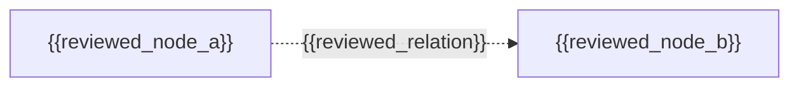

# {{distillation_id}} Concept Map

> 本文件是私有 `concept-map.yml` 人工审阅视图，不增加 YAML 中不存在的节点或关系，
> 也不得直接进入 downstream candidate 或 public output。

## 图例

- `explicit`：来源明示；
- `implicit`：来源隐含但可近距离还原；
- `implicit` / `inferred`：需要显式人工决定和推理理由；
- 虚线关系不得被描述为已由来源直接证明。

## 关系表

| relation_id | subject | predicate | object | 限定条件 | 明示/推断 | claim/evidence | human decision |
|---|---|---|---|---|---|---|---|
| {{relation_id}} | {{subject}} | {{predicate}} | {{object}} | {{qualifiers}} | {{relation_status}} | {{trace}} | {{human_decision}} |

## 可视化

## 缺口和禁止补全项

- 不可读节点/箭头：{{unreadable_items}}
- 未解决冲突：{{conflicts}}
- 来源未提供且不得补出的关系：{{forbidden_inferences}}
